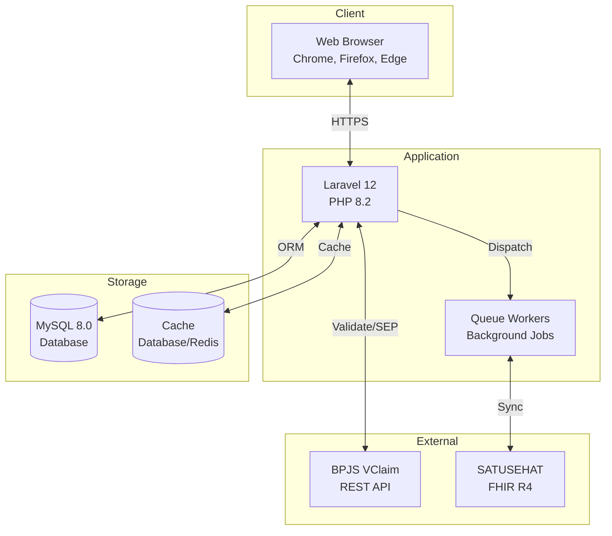
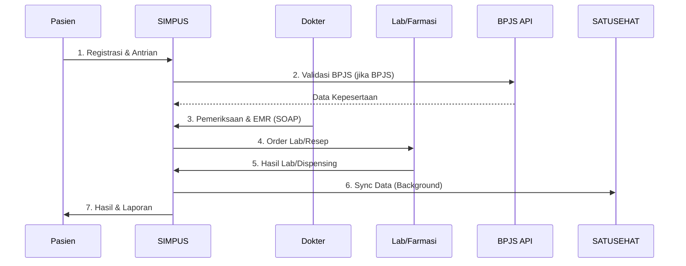

# SIMPUS - Sistem Informasi Manajemen Puskesmas

<div align="center">


**Sistem Informasi Manajemen Puskesmas berbasis Laravel dengan Integrasi BPJS VClaim & SATUSEHAT FHIR R4**

[Fitur](#-fitur-utama) • [Instalasi](#-quick-start) • [Dokumentasi](#-dokumentasi) • [Demo](#-demo) • [Kontribusi](#-contributing)

</div>

---

## 📖 Tentang Proyek

SIMPUS adalah aplikasi web modern untuk manajemen klinik/puskesmas yang dilengkapi dengan:
- ✅ Electronic Medical Record (EMR) lengkap
- ✅ Integrasi BPJS VClaim dengan **Mock API** untuk testing
- ✅ Integrasi SATUSEHAT FHIR R4 dengan **Mock API** untuk testing
- ✅ Sistem antrian real-time per poliklinik
- ✅ Laboratorium & Farmasi terintegrasi
- ✅ Role-based access control (6 role user)
- ✅ Export laporan Excel & PDF
- ✅ Audit log lengkap

## 🎯 Fitur Utama

### 🏥 Manajemen Klinik
- **Pendaftaran Pasien** - Manajemen data pasien dengan No. RM otomatis, NIK, BPJS
- **Kunjungan & EMR** - Electronic Medical Record lengkap dengan diagnosis, tindakan, resep
- **Sistem Antrian** - Queue management dengan monitor real-time per poli
- **Pencarian Cerdas** - Search suggestion untuk data pasien dan obat

### 🔬 Layanan Medis
- **Laboratorium** - Permintaan dan hasil tes lab dengan print report PDF
- **Farmasi** - Manajemen resep, dispensing obat, dan master obat
- **Rujukan** - Manajemen rujukan internal dan eksternal
- **EMR Notes** - Catatan medis terstruktur per kunjungan

### 🔗 Integrasi Eksternal

#### BPJS VClaim REST API
- ✅ Validasi kepesertaan BPJS (by NIK atau No. Kartu)
- ✅ Manajemen SEP (Create, Update, Delete)
- ✅ Cek rujukan FKTP/FKTL
- ✅ Referensi (Diagnosa ICD-10, Poli, Faskes, Prosedur)
- ✅ Monitoring klaim BPJS
- ✅ **Mock API Mode** - Testing tanpa kredensial BPJS asli
- ✅ **Database-driven status** - Status BPJS disimpan di database, realistis seperti sistem asli

📚 **[Dokumentasi BPJS →](docs/BPJS-INTEGRATION.md)**

#### SATUSEHAT FHIR R4
- ✅ Sinkronisasi Patient (NIK, No. BPJS)
- ✅ Sinkronisasi Encounter (Kunjungan)
- ✅ Sinkronisasi Observation (Lab results, Vital signs)
- ✅ Background queue processing
- ✅ **Mock API Mode** - Testing tanpa kredensial SATUSEHAT asli
- ✅ **Retry mechanism** untuk failed jobs

📚 **[Dokumentasi SATUSEHAT →](docs/SATUSEHAT-INTEGRATION.md)**

### 📊 Pelaporan & Monitoring
- **Dashboard** - Statistik kunjungan, pasien, dan layanan real-time
- **Laporan** - Export laporan ke Excel (kunjungan, lab, farmasi)
- **Audit Log** - Tracking aktivitas pengguna sistem dengan detail lengkap
- **Queue Monitor** - Monitor antrian per poli dengan status real-time

### 👥 Manajemen User & Keamanan
- **6 Role User**: Administrator, Dokter, Rekam Medis, Pendaftaran, Lab, Apotek
- **Role-based Access Control** - Granular permission management
- **Authentication** - Laravel Breeze dengan session security
- **Audit Trail** - Log semua aktivitas CRUD

## 🛠️ Technology Stack

| Layer | Technology |
|-------|------------|
| **Backend** | Laravel 12, PHP 8.2 |
| **Database** | MySQL 8.0+ / MariaDB 10.6+ |
| **Frontend** | Alpine.js 3, Tailwind CSS 3, Vite 7 |
| **Auth** | Laravel Breeze |
| **Permissions** | Spatie Laravel Permission |
| **Queue** | Database driver dengan Redis support |
| **Cache** | Database/Redis |
| **Export** | Maatwebsite Excel, DomPDF |
| **Integration** | BPJS VClaim REST API, SATUSEHAT FHIR R4 |

## 📊 System Overview

### High-Level Architecture



### Data Flow Overview



## 📚 Dokumentasi

| Dokumentasi | Deskripsi |
|-------------|-----------|
| **[Database Schema & ERD](docs/DATABASE-SCHEMA.md)** | 📊 ERD lengkap, struktur tabel, relasi database, indexes |
| **[Architecture & DFD](docs/ARCHITECTURE.md)** | 🏗️ System architecture, DFD (Level 0-2), sequence diagrams |
| **[BPJS Integration](docs/BPJS-INTEGRATION.md)** | 🔗 Panduan lengkap integrasi BPJS VClaim, Mock API, testing |
| **[SATUSEHAT Integration](docs/SATUSEHAT-INTEGRATION.md)** | 🔗 Panduan lengkap integrasi SATUSEHAT FHIR R4, Mock API |
| **[Development Guide](docs/DEVELOPMENT-GUIDE.md)** | 👨‍💻 Panduan development, testing, debugging |
| **[Deployment Guide](docs/DEPLOYMENT.md)** | 🚀 Panduan deployment production |
| **[API Documentation](docs/API-DOCUMENTATION.md)** | 📡 REST API endpoints, request/response |
| **[Sharing Project](SHARING.md)** | 🤝 Cara berbagi project dengan tim |

## 📋 Requirements

- **PHP** >= 8.2.24
- **Composer** >= 2.x
- **Node.js** >= 18.x & npm
- **MySQL** >= 8.0 atau MariaDB >= 10.6
- **Redis** (optional, untuk queue & cache)
- **Web Server**: Apache/Nginx atau Laragon (Windows)
- **Git**

## 🚀 Quick Start

### Opsi 1: Auto Setup (Recommended) ⚡

Jalankan satu perintah untuk setup otomatis:

```bash
composer run setup
```

Script ini akan:
- ✅ Copy `.env.example` ke `.env`
- ✅ Generate application key
- ✅ Install dependencies (composer & npm)
- ✅ Run migrations & seeders
- ✅ Build frontend assets

**Setelah setup**, edit `.env` untuk konfigurasi database Anda, lalu jalankan:

```bash
php artisan migrate:fresh --seed
```

### Opsi 2: Manual Setup

<details>
<summary>Klik untuk lihat langkah manual setup</summary>

#### 1. Clone & Setup Environment

```bash
# Clone repository
git clone https://github.com/Haluluya/Simpus.git
cd Simpus

# Copy environment file
cp .env.example .env
```

#### 2. Konfigurasi Database

Edit `.env` dan sesuaikan:

```env
DB_DATABASE=simpus
DB_USERNAME=root
DB_PASSWORD=
```

Buat database:

```bash
# MySQL CLI
mysql -u root -p -e "CREATE DATABASE simpus CHARACTER SET utf8mb4 COLLATE utf8mb4_unicode_ci;"
```

#### 3. Install & Build

```bash
# Install dependencies
composer install
npm install

# Generate app key
php artisan key:generate

# Run migrations & seeders
php artisan migrate --seed

# Storage link
php artisan storage:link

# Build frontend assets
npm run build
```

#### 4. Jalankan Aplikasi

**Development Mode** (dengan queue worker, logs, dan hot reload):

```bash
composer run dev
```

**Manual Mode**:

```bash
# Terminal 1: Web server
php artisan serve

# Terminal 2: Queue worker (optional untuk SATUSEHAT sync)
php artisan queue:work --queue=default,satusehat

# Terminal 3: Frontend dev server
npm run dev
```

Akses aplikasi di `http://localhost:8000`

</details>

### Setup dengan Laragon (Windows) 🪟

<details>
<summary>Klik untuk lihat setup Laragon</summary>

1. Install [Laragon](https://laragon.org/) dengan PHP 8.2+, Composer, Node.js, MySQL
2. Clone project ke `D:\laragon\www\Simpus`
3. Buat virtual host: Klik kanan Laragon → Apache → Add Virtual Host
   - Nama: `simpus.test`
   - Folder: `D:\laragon\www\Simpus\public`
4. Ikuti langkah manual setup di atas
5. Akses di `http://simpus.test`

</details>

## 👤 Akun Default (Seeder)

Setelah `php artisan migrate --seed`, gunakan akun berikut untuk login:

| Role | Email | Password |
|------|-------|----------|
| 👑 Administrator | admin@simpus.test | password123 |
| 🩺 Dokter | dokter@simpus.test | password123 |
| 📋 Petugas Rekam Medis | rekammedis@simpus.test | password123 |
| 📝 Petugas Pendaftaran | pendaftaran@simpus.test | password123 |
| 💊 Petugas Apotek | apotik@simpus.test | password123 |
| 🔬 Petugas Lab | lab@simpus.test | password123 |

## ⚙️ Konfigurasi

### BPJS VClaim (Mock Mode untuk Testing)

Edit `.env`:

```env
BPJS_BASE_URL=https://new-api.bpjs-kesehatan.go.id/vclaim-rest/
BPJS_CONS_ID=your_cons_id
BPJS_SECRET=your_secret_key
BPJS_USER_KEY=your_user_key
BPJS_USE_MOCK=true  # ✅ true untuk testing tanpa kredensial
BPJS_TIMEOUT=10
```

**✨ Mock Mode Features:**
- ✅ Testing tanpa kredensial BPJS asli
- ✅ Data mock yang realistis (10 pasien BPJS)
- ✅ Status BPJS disimpan di database (bukan magic number)
- ✅ 8 pasien AKTIF, 2 pasien TIDAK AKTIF (menunggak iuran)
- ✅ Response sesuai format API BPJS asli

📚 **[Panduan lengkap BPJS Mock API →](docs/BPJS-INTEGRATION.md#mock-api-mode)**

### SATUSEHAT FHIR (Mock Mode untuk Testing)

Edit `.env`:

```env
SATUSEHAT_BASE_URL=https://api-satusehat.kemkes.go.id/fhir-r4
SATUSEHAT_AUTH_URL=https://api-satusehat.kemkes.go.id/oauth2/v1
SATUSEHAT_CLIENT_ID=your_client_id
SATUSEHAT_CLIENT_SECRET=your_client_secret
SATUSEHAT_ORGANIZATION_ID=your_org_id
SATUSEHAT_FACILITY_ID=your_facility_id
SATUSEHAT_USE_MOCK=true  # ✅ true untuk testing tanpa kredensial
SATUSEHAT_TIMEOUT=10
```

**✨ Mock Mode Features:**
- ✅ Testing tanpa kredensial SATUSEHAT asli
- ✅ Generate ID FHIR yang valid
- ✅ Response sesuai format FHIR R4
- ✅ Support Patient, Encounter, Observation

📚 **[Panduan lengkap SATUSEHAT Mock API →](docs/SATUSEHAT-INTEGRATION.md#mock-api-mode)**

### Queue Worker (untuk SATUSEHAT Sync)

Queue diperlukan untuk sinkronisasi SATUSEHAT. Jalankan:

```bash
# Development
php artisan queue:work --queue=default,satusehat

# Atau gunakan composer run dev (sudah include queue worker)
composer run dev
```

Production setup dengan Supervisor (lihat [Deployment Guide](docs/DEPLOYMENT.md)).

## 📦 Useful Commands

<details>
<summary>Development Commands</summary>

```bash
# Development server dengan queue & hot reload
composer run dev

# Run specific artisan commands
php artisan serve              # Start dev server
php artisan queue:work         # Start queue worker
npm run dev                    # Vite dev server dengan HMR

# Run tests
composer run test
php artisan test --filter=NamaTest
```

</details>

<details>
<summary>Cache Management</summary>

```bash
# Clear all cache
php artisan optimize:clear

# Production optimization
php artisan config:cache
php artisan route:cache
php artisan view:cache
php artisan optimize
```

</details>

<details>
<summary>Database Commands</summary>

```bash
# Fresh migration dengan seeder (AMAN dijalankan berulang kali)
php artisan migrate:fresh --seed

# Rollback
php artisan migrate:rollback

# Reset database
php artisan migrate:reset
```

</details>

<details>
<summary>Code Quality</summary>

```bash
# Laravel Pint (code formatter)
vendor/bin/pint              # Format all files
vendor/bin/pint --dirty      # Format only changed files
vendor/bin/pint --test       # Test without formatting
```

</details>

## 🧪 Testing

```bash
# Run all tests
php artisan test

# Run specific test
php artisan test tests/Feature/PatientTest.php
php artisan test --filter=test_can_create_patient

# With coverage
php artisan test --coverage
```

### API Testing dengan Postman

Import collection dari `postman/SIMPUS.postman_collection.json`:

- 🔐 **Auth**: Login & Logout
- 👤 **Patients**: CRUD pasien
- 🏥 **Visits**: Kunjungan & EMR
- 🔬 **Lab**: Permintaan dan hasil lab
- 💊 **Pharmacy**: Resep dan dispensing
- 📋 **Queue**: Antrian pasien
- 🔗 **BPJS**: Validasi peserta, SEP, rujukan
- 🔗 **SATUSEHAT**: Sync Patient/Encounter/Observation
- 📊 **Reports**: Export Excel

## 🐛 Troubleshooting

<details>
<summary>No application encryption key</summary>

```bash
php artisan key:generate
```

</details>

<details>
<summary>Unknown database</summary>

Buat database terlebih dahulu:

```bash
mysql -u root -p -e "CREATE DATABASE simpus CHARACTER SET utf8mb4 COLLATE utf8mb4_unicode_ci;"
```

</details>

<details>
<summary>Frontend tidak muncul / 404 assets</summary>

```bash
npm run build
php artisan optimize:clear
```

</details>

<details>
<summary>Queue tidak berjalan</summary>

Pastikan konfigurasi queue di `.env`:

```env
QUEUE_CONNECTION=database
```

Start queue worker:

```bash
php artisan queue:work --queue=default,satusehat
```

</details>

<details>
<summary>BPJS/SATUSEHAT connection timeout</summary>

Aktifkan mock mode untuk testing:

```env
BPJS_USE_MOCK=true
SATUSEHAT_USE_MOCK=true
```

</details>

## 📸 Demo

### Dashboard


### Pendaftaran Pasien


### BPJS Verification


### Queue Monitor


> **Note**: Tambahkan screenshot ke folder `docs/screenshots/`

## 🚢 Production Deployment

Lihat panduan lengkap deployment production di **[Deployment Guide](docs/DEPLOYMENT.md)**

Quick summary:

```bash
# 1. Install dependencies
composer install --optimize-autoloader --no-dev
npm ci && npm run build

# 2. Setup environment
cp .env.example .env
php artisan key:generate --force

# 3. Database migration
php artisan migrate --force --seed
php artisan storage:link

# 4. Optimization
php artisan config:cache
php artisan route:cache
php artisan view:cache
php artisan optimize
```

## 🤝 Contributing

Kontribusi sangat diterima! Untuk berkontribusi:

1. Fork repository
2. Buat feature branch (`git checkout -b feature/AmazingFeature`)
3. Commit changes (`git commit -m 'Add: amazing feature'`)
4. Push ke branch (`git push origin feature/AmazingFeature`)
5. Buat Pull Request

Pastikan code sudah diformat dengan Laravel Pint dan lolos semua tests:

```bash
vendor/bin/pint --dirty
php artisan test
```

Baca **[Contributing Guide](CONTRIBUTING.md)** untuk detail lebih lanjut.

## 📝 Changelog

Lihat **[CHANGELOG.md](CHANGELOG.md)** untuk history perubahan versi.

## 📝 License

Project ini dilisensikan di bawah [MIT License](LICENSE).

## 📧 Support & Contact

- **Repository**: [https://github.com/Haluluya/Simpus](https://github.com/Haluluya/Simpus)
- **Issues**: [https://github.com/Haluluya/Simpus/issues](https://github.com/Haluluya/Simpus/issues)
- **Documentation**: [docs/](docs/)

## 🙏 Acknowledgments

- [Laravel](https://laravel.com/) - The PHP Framework
- [Tailwind CSS](https://tailwindcss.com/) - CSS Framework
- [Alpine.js](https://alpinejs.dev/) - Lightweight JS framework
- [Spatie Laravel Permission](https://spatie.be/docs/laravel-permission/) - Role & Permission management
- BPJS Kesehatan - VClaim REST API documentation
- Kementerian Kesehatan RI - SATUSEHAT FHIR R4 API

---

<div align="center">

**Untuk Developer Baru**:

📖 Baca [Development Guide](docs/DEVELOPMENT-GUIDE.md) untuk memulai development

📊 Lihat [Database Schema](docs/DATABASE-SCHEMA.md) untuk memahami struktur database

🔗 Pelajari [BPJS Integration](docs/BPJS-INTEGRATION.md) & [SATUSEHAT Integration](docs/SATUSEHAT-INTEGRATION.md)

Made with ❤️ by [Haluluya](https://github.com/Haluluya)

</div>
