# System Architecture - SIMPUS

## 📐 Architecture Overview

SIMPUS menggunakan arsitektur **MVC (Model-View-Controller)** berbasis Laravel dengan integrasi ke sistem eksternal (BPJS VClaim dan SATUSEHAT FHIR R4).

### Technology Stack

```
┌─────────────────────────────────────────────────────────────┐
│                        CLIENT LAYER                         │
│  Browser (Chrome, Firefox, Edge, Safari)                    │
│  - HTML5, CSS3 (Tailwind CSS 3)                            │
│  - JavaScript (Alpine.js 3, Vanilla JS)                    │
│  - Vite 7 (Build tool, HMR)                                │
└─────────────────────────────────────────────────────────────┘
                              │
                              │ HTTP/HTTPS
                              ▼
┌─────────────────────────────────────────────────────────────┐
│                    APPLICATION LAYER                        │
│  Laravel 12 (PHP 8.2+)                                      │
│  - Controllers (Business Logic)                             │
│  - Models (Eloquent ORM)                                    │
│  - Views (Blade Templates)                                  │
│  - Services (BPJS, SATUSEHAT)                              │
│  - Middleware (Auth, CORS, etc)                            │
│  - Queue Jobs (SATUSEHAT Sync)                             │
└─────────────────────────────────────────────────────────────┘
                              │
                              │
                              ▼
┌─────────────────────────────────────────────────────────────┐
│                      DATA LAYER                             │
│  MySQL 8.0+ / MariaDB 10.6+                                │
│  - Relational Database                                      │
│  - Foreign Keys & Constraints                               │
│  - Indexes for Performance                                  │
│  - JSON columns for flexibility                             │
└─────────────────────────────────────────────────────────────┘
                              │
                              │
        ┌─────────────────────┼─────────────────────┐
        │                     │                     │
        ▼                     ▼                     ▼
┌──────────────┐    ┌──────────────┐    ┌──────────────┐
│  BPJS VClaim │    │  SATUSEHAT   │    │    Cache     │
│   REST API   │    │   FHIR R4    │    │ Database/    │
│              │    │              │    │   Redis      │
└──────────────┘    └──────────────┘    └──────────────┘
```

---

## 📊 Data Flow Diagram (DFD)

### DFD Level 0 - Context Diagram

Diagram ini menunjukkan sistem SIMPUS secara keseluruhan dan interaksinya dengan entitas eksternal.

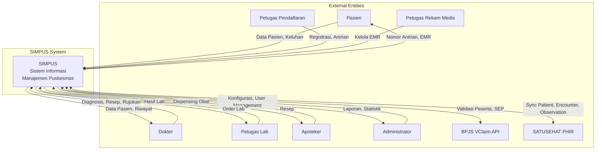

**External Entities:**
1. **Pasien** - Menerima layanan kesehatan
2. **Dokter** - Melakukan pemeriksaan dan diagnosis
3. **Petugas Lab** - Melakukan pemeriksaan laboratorium
4. **Apoteker** - Melayani resep obat
5. **Petugas Rekam Medis** - Mengelola data rekam medis
6. **Petugas Pendaftaran** - Registrasi dan antrian pasien
7. **Administrator** - Mengelola sistem dan user
8. **BPJS VClaim API** - Validasi kepesertaan dan SEP
9. **SATUSEHAT FHIR** - Integrasi data ke sistem nasional

---

### DFD Level 1 - Main Processes

Diagram ini memecah sistem SIMPUS menjadi proses-proses utama.

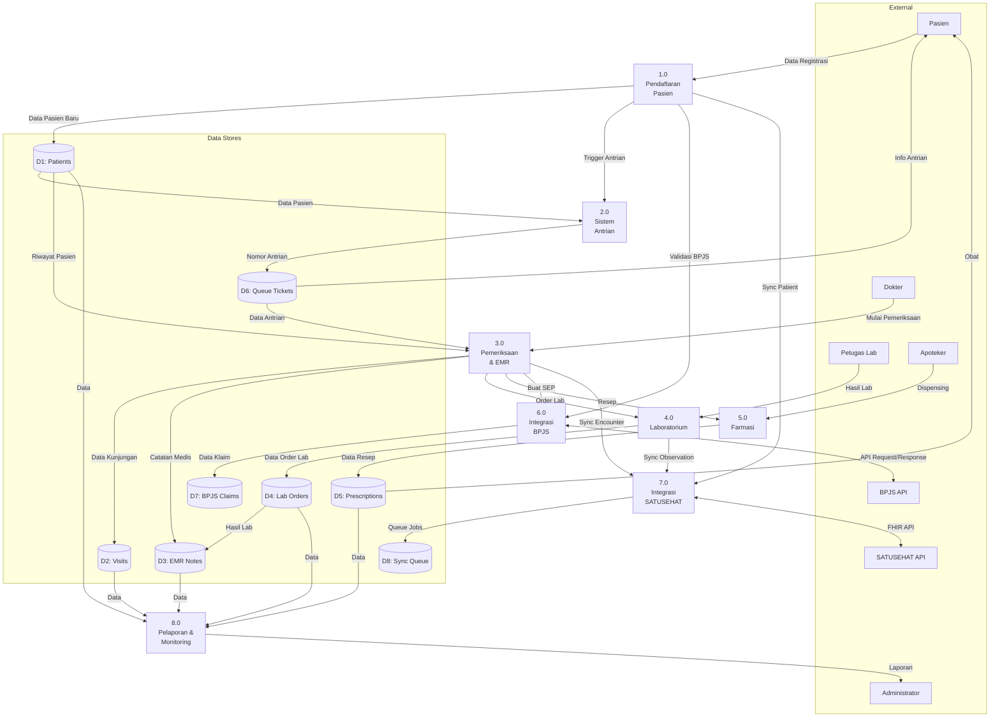

**Main Processes:**

1. **1.0 Pendaftaran Pasien**
   - Input: Data pasien dari petugas pendaftaran
   - Output: Data pasien tersimpan, trigger sistem antrian
   - Data Store: D1 (Patients)

2. **2.0 Sistem Antrian**
   - Input: Data pasien, poliklinik, metode pembayaran
   - Output: Nomor antrian, status antrian
   - Data Store: D6 (Queue Tickets)

3. **3.0 Pemeriksaan & EMR**
   - Input: Data pasien, keluhan, pemeriksaan dokter
   - Output: Diagnosis, catatan medis, order lab, resep
   - Data Store: D2 (Visits), D3 (EMR Notes)

4. **4.0 Laboratorium**
   - Input: Order laboratorium dari dokter
   - Output: Hasil pemeriksaan lab
   - Data Store: D4 (Lab Orders)

5. **5.0 Farmasi**
   - Input: Resep dari dokter
   - Output: Obat yang didispensing
   - Data Store: D5 (Prescriptions)

6. **6.0 Integrasi BPJS**
   - Input: Data pasien BPJS, data kunjungan
   - Output: Validasi peserta, SEP, data klaim
   - Data Store: D7 (BPJS Claims)
   - External: BPJS VClaim API

7. **7.0 Integrasi SATUSEHAT**
   - Input: Data pasien, kunjungan, hasil lab
   - Output: Data terkirim ke SATUSEHAT
   - Data Store: D8 (Sync Queue)
   - External: SATUSEHAT FHIR API

8. **8.0 Pelaporan & Monitoring**
   - Input: Semua data dari data stores
   - Output: Dashboard, laporan Excel/PDF, statistik
   - Data Store: D1-D5 (Read-only)

---

### DFD Level 2 - Detailed Process Flows

#### 2.1 DFD Level 2: Process 1.0 - Pendaftaran Pasien

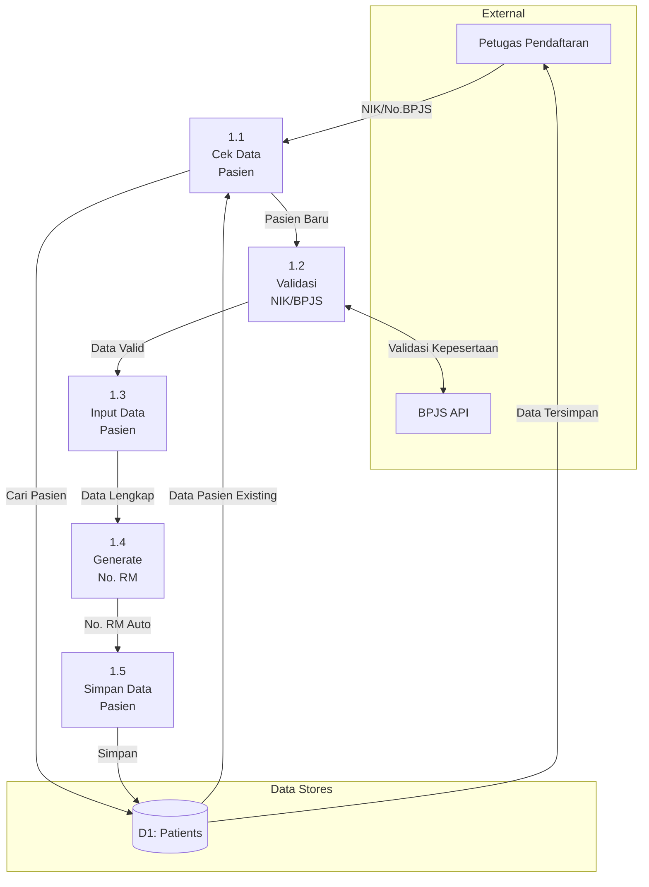

**Sub-processes:**
- **1.1 Cek Data Pasien** - Cari pasien berdasarkan NIK/No.BPJS
- **1.2 Validasi NIK/BPJS** - Validasi ke BPJS API (jika pasien BPJS)
- **1.3 Input Data Pasien** - Form input data demografi
- **1.4 Generate No. RM** - Auto-generate medical record number
- **1.5 Simpan Data Pasien** - Simpan ke database

---

#### 2.2 DFD Level 2: Process 3.0 - Pemeriksaan & EMR

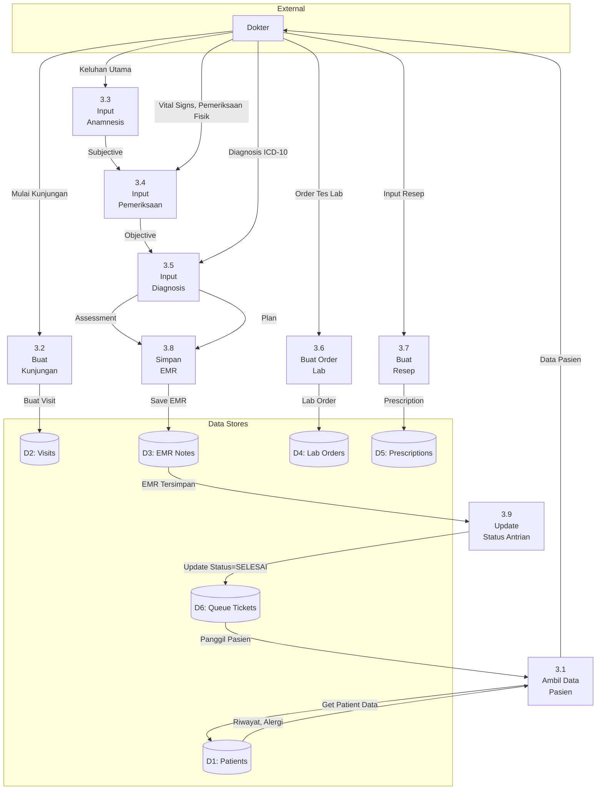

**Sub-processes:**
- **3.1 Ambil Data Pasien** - Load data pasien dan riwayat medis
- **3.2 Buat Kunjungan** - Create visit record baru
- **3.3 Input Anamnesis** - Subjective (SOAP): keluhan, riwayat penyakit
- **3.4 Input Pemeriksaan** - Objective (SOAP): vital signs, pemeriksaan fisik
- **3.5 Input Diagnosis** - Assessment (SOAP): diagnosis dengan ICD-10
- **3.6 Buat Order Lab** - Jika perlu pemeriksaan lab
- **3.7 Buat Resep** - Plan (SOAP): terapi farmakologi
- **3.8 Simpan EMR** - Simpan catatan medis lengkap
- **3.9 Update Status Antrian** - Ubah status antrian jadi SELESAI

---

#### 2.3 DFD Level 2: Process 6.0 - Integrasi BPJS

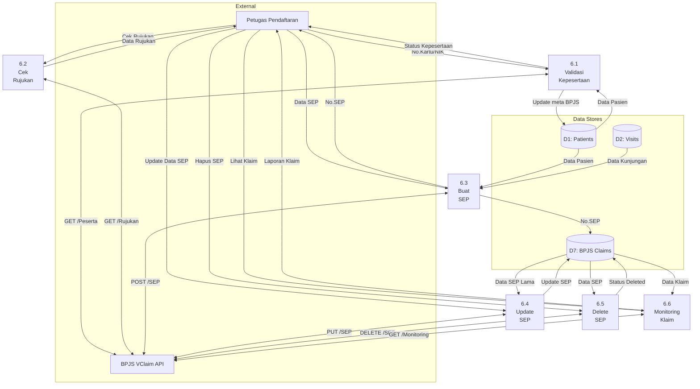

**Sub-processes:**
- **6.1 Validasi Kepesertaan** - Validasi status BPJS pasien (AKTIF/TIDAK AKTIF)
- **6.2 Cek Rujukan** - Cek rujukan FKTP/FKTL
- **6.3 Buat SEP** - Create Surat Eligibilitas Peserta
- **6.4 Update SEP** - Update data SEP
- **6.5 Delete SEP** - Hapus SEP (jika salah input)
- **6.6 Monitoring Klaim** - Monitor status klaim BPJS

---

#### 2.4 DFD Level 2: Process 7.0 - Integrasi SATUSEHAT

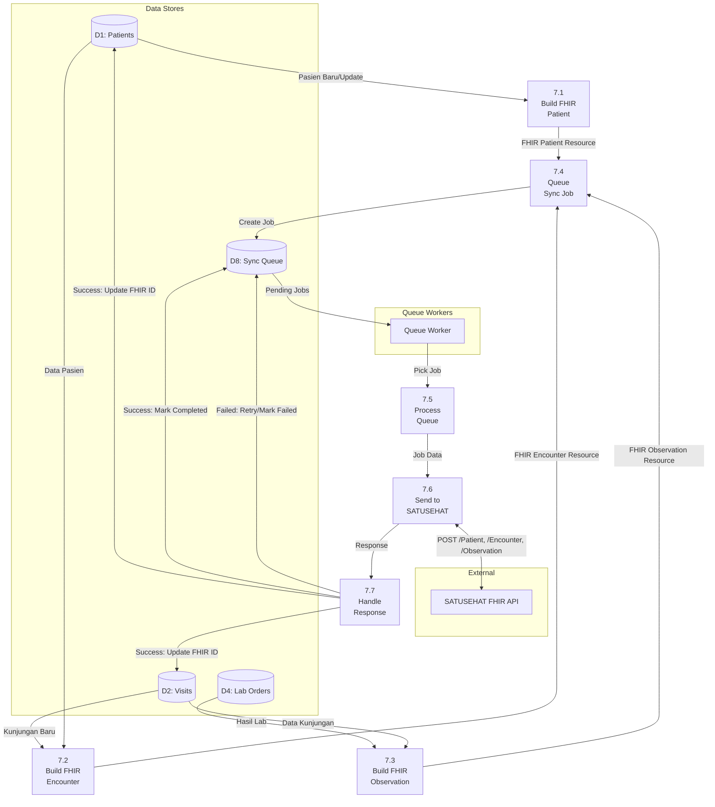

**Sub-processes:**
- **7.1 Build FHIR Patient** - Convert data pasien ke FHIR Patient resource
- **7.2 Build FHIR Encounter** - Convert data kunjungan ke FHIR Encounter resource
- **7.3 Build FHIR Observation** - Convert hasil lab ke FHIR Observation resource
- **7.4 Queue Sync Job** - Tambahkan job ke sync queue
- **7.5 Process Queue** - Queue worker ambil pending jobs
- **7.6 Send to SATUSEHAT** - Kirim HTTP request ke SATUSEHAT API
- **7.7 Handle Response** - Proses response (success/failed), retry mechanism

---

## 🏗️ Component Diagram

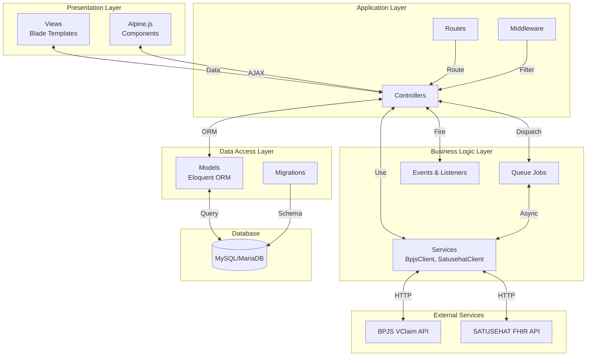

**Components:**

1. **Presentation Layer**
   - **Views**: Blade templates untuk rendering HTML
   - **Alpine.js Components**: Interactive UI components

2. **Application Layer**
   - **Controllers**: Handle HTTP requests & responses
   - **Middleware**: Authentication, authorization, logging
   - **Routes**: URL routing configuration

3. **Business Logic Layer**
   - **Services**: BPJS client, SATUSEHAT client, business rules
   - **Queue Jobs**: Async processing untuk SATUSEHAT sync
   - **Events & Listeners**: Event-driven architecture

4. **Data Access Layer**
   - **Models**: Eloquent ORM models
   - **Migrations**: Database schema version control

5. **External Services**
   - **BPJS VClaim API**: REST API untuk BPJS integration
   - **SATUSEHAT FHIR API**: FHIR R4 API untuk SATUSEHAT integration

6. **Database**
   - **MySQL/MariaDB**: Relational database

---

## 🔄 Sequence Diagrams

### Sequence Diagram: Pendaftaran Pasien BPJS

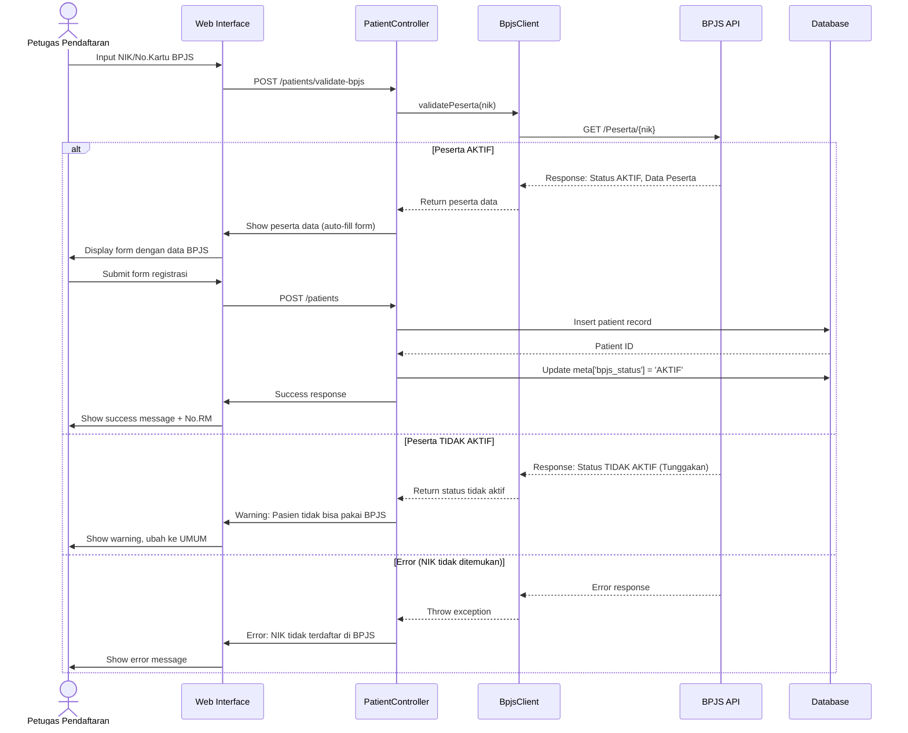

---

### Sequence Diagram: Pemeriksaan & EMR (SOAP)

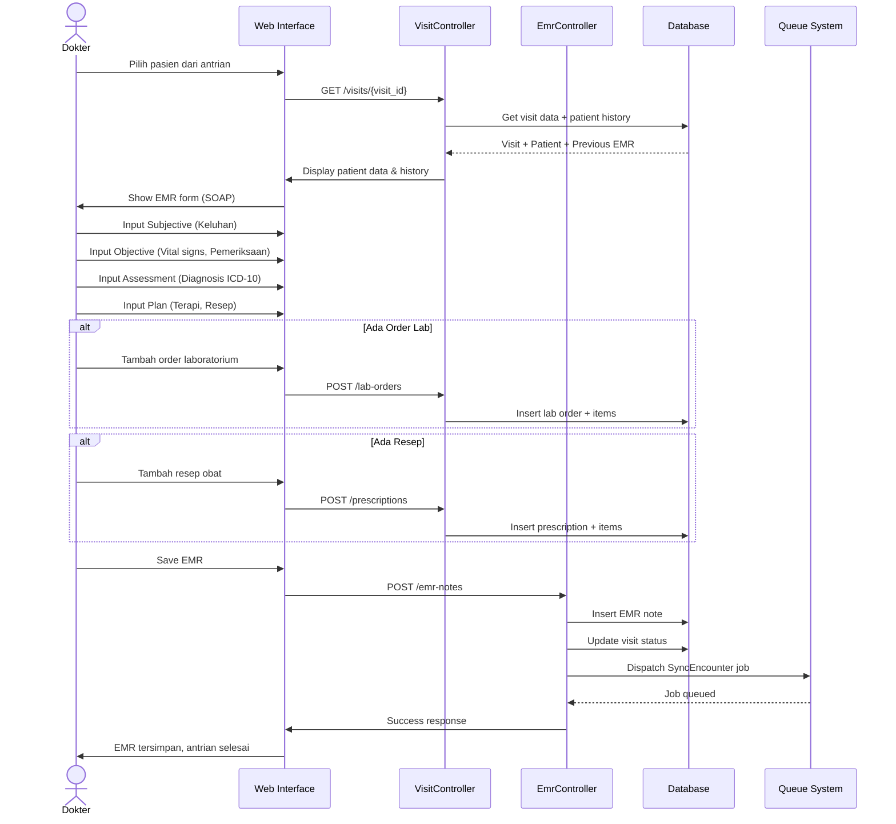

---

### Sequence Diagram: SATUSEHAT Sync (Background Job)

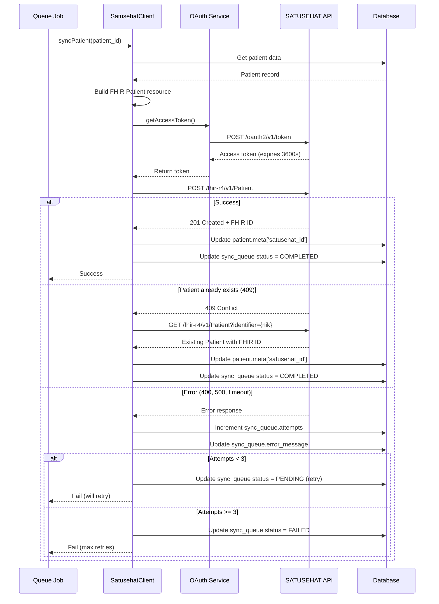

---

## 🚀 Deployment Architecture

### Production Deployment Diagram

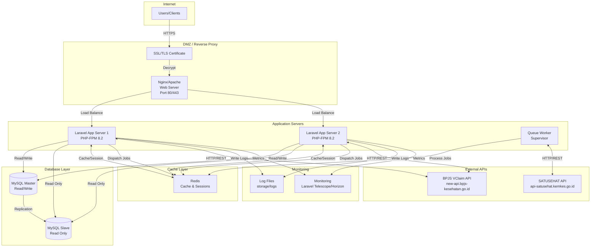

**Infrastructure Components:**

1. **Web Server (Nginx/Apache)**
   - SSL/TLS termination
   - Static file serving
   - Load balancing (multiple app servers)
   - Rate limiting
   - GZIP compression

2. **Application Servers (PHP-FPM)**
   - Multiple instances untuk high availability
   - Session storage di Redis (shared)
   - Horizontal scaling ready

3. **Queue Workers (Supervisor)**
   - Background job processing
   - SATUSEHAT sync jobs
   - Email notifications
   - Report generation
   - Auto-restart on failure

4. **Database (MySQL)**
   - Master-slave replication
   - Automated backups (daily)
   - Point-in-time recovery
   - Connection pooling

5. **Cache (Redis)**
   - Session storage
   - Application cache
   - Queue driver
   - Rate limiting

6. **Monitoring & Logging**
   - Laravel Telescope (development)
   - Laravel Horizon (queue monitoring)
   - Log rotation (daily)
   - Error tracking

---

## 🔐 Security Architecture

### Security Layers

```
┌─────────────────────────────────────────────────────────────┐
│  Layer 1: Network Security                                  │
│  - Firewall (Allow only 80/443)                            │
│  - DDoS protection                                          │
│  - Rate limiting                                            │
└─────────────────────────────────────────────────────────────┘
                              │
┌─────────────────────────────────────────────────────────────┐
│  Layer 2: Transport Security                                │
│  - SSL/TLS encryption (HTTPS)                               │
│  - Certificate validation                                   │
│  - Secure headers (HSTS, CSP, X-Frame-Options)             │
└─────────────────────────────────────────────────────────────┘
                              │
┌─────────────────────────────────────────────────────────────┐
│  Layer 3: Authentication & Authorization                    │
│  - Laravel Breeze (Session-based auth)                      │
│  - Password hashing (bcrypt)                                │
│  - CSRF protection                                          │
│  - Spatie Permission (RBAC)                                 │
└─────────────────────────────────────────────────────────────┘
                              │
┌─────────────────────────────────────────────────────────────┐
│  Layer 4: Application Security                              │
│  - Input validation & sanitization                          │
│  - SQL injection prevention (Eloquent ORM)                  │
│  - XSS prevention (Blade escaping)                          │
│  - File upload validation                                   │
│  - API authentication (BPJS signature, OAuth2)              │
└─────────────────────────────────────────────────────────────┘
                              │
┌─────────────────────────────────────────────────────────────┐
│  Layer 5: Data Security                                     │
│  - Database encryption at rest (optional)                   │
│  - Sensitive data masking                                   │
│  - Audit logging                                            │
│  - Regular backups                                          │
│  - Soft deletes (data retention)                            │
└─────────────────────────────────────────────────────────────┘
```

### Authentication Flow

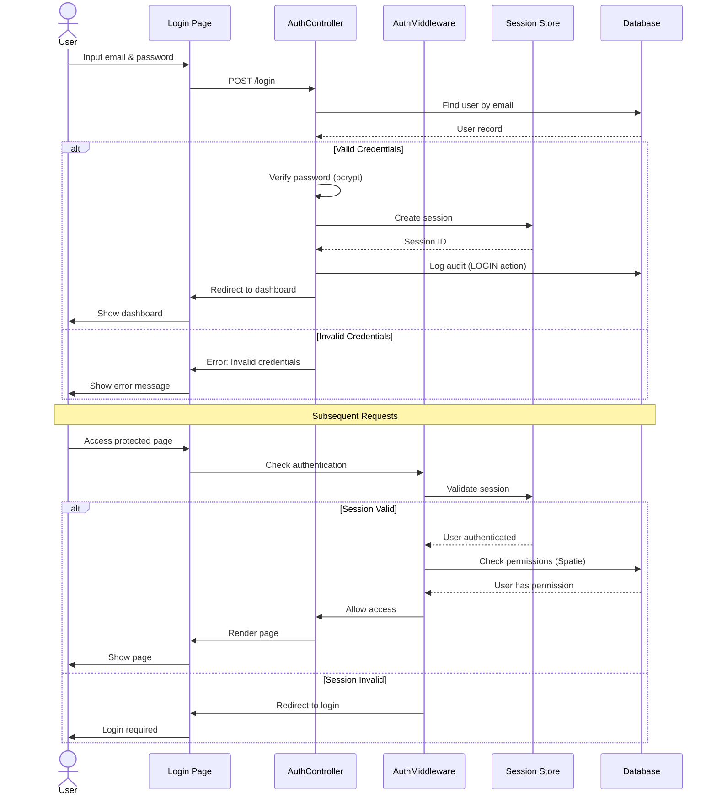

---

## 📈 Scalability & Performance

### Horizontal Scaling

**Application Servers:**
```
Load Balancer (Nginx)
       │
       ├─── App Server 1 (PHP-FPM)
       ├─── App Server 2 (PHP-FPM)
       ├─── App Server 3 (PHP-FPM)
       └─── App Server N (PHP-FPM)
```

**Queue Workers:**
```
Redis Queue
       │
       ├─── Worker 1 (Supervisor)
       ├─── Worker 2 (Supervisor)
       └─── Worker N (Supervisor)
```

**Database:**
```
Master (Write)
  │
  ├─── Slave 1 (Read)
  ├─── Slave 2 (Read)
  └─── Slave N (Read)
```

### Performance Optimization

1. **Query Optimization**
   - Proper indexing (see DATABASE-SCHEMA.md)
   - Eager loading (prevent N+1 queries)
   - Query caching
   - Database connection pooling

2. **Caching Strategy**
   - Route caching: `php artisan route:cache`
   - Config caching: `php artisan config:cache`
   - View caching: `php artisan view:cache`
   - Application caching: Redis cache driver
   - HTTP caching: ETags, Last-Modified headers

3. **Asset Optimization**
   - Vite build optimization
   - CSS/JS minification
   - Image optimization (lazy loading, WebP)
   - CDN for static assets (optional)

4. **Queue Optimization**
   - Separate queues by priority
   - Multiple queue workers
   - Failed job handling
   - Queue monitoring (Horizon)

---

## 📚 See Also

- [Database Schema & ERD](DATABASE-SCHEMA.md)
- [BPJS Integration](BPJS-INTEGRATION.md)
- [SATUSEHAT Integration](SATUSEHAT-INTEGRATION.md)
- [Development Guide](DEVELOPMENT-GUIDE.md)
- [Deployment Guide](DEPLOYMENT.md)
