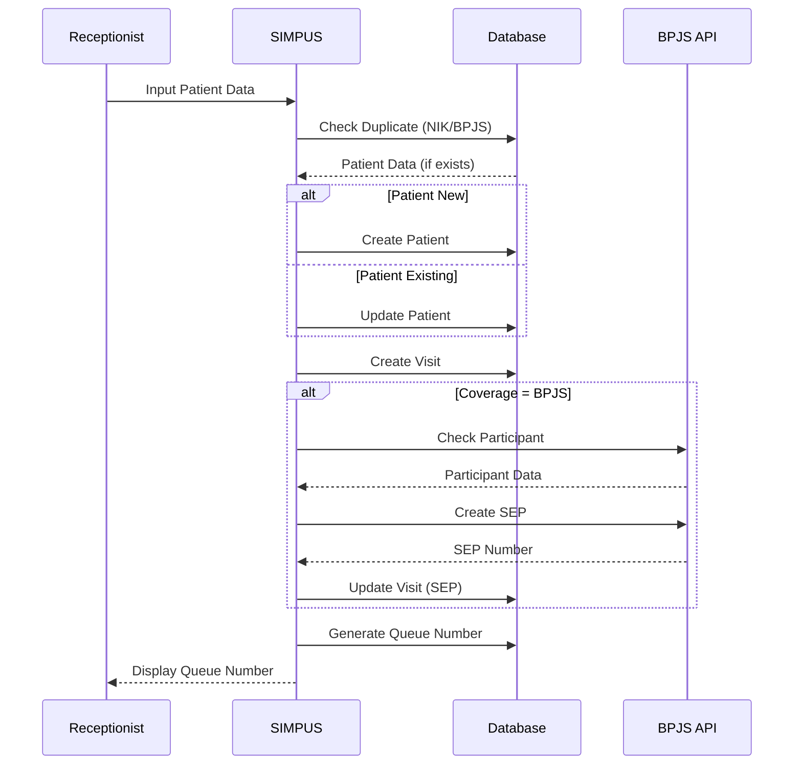
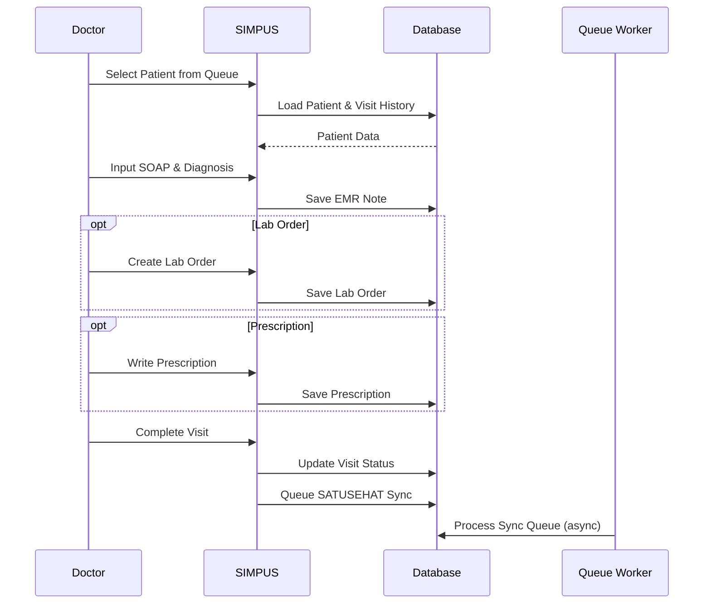
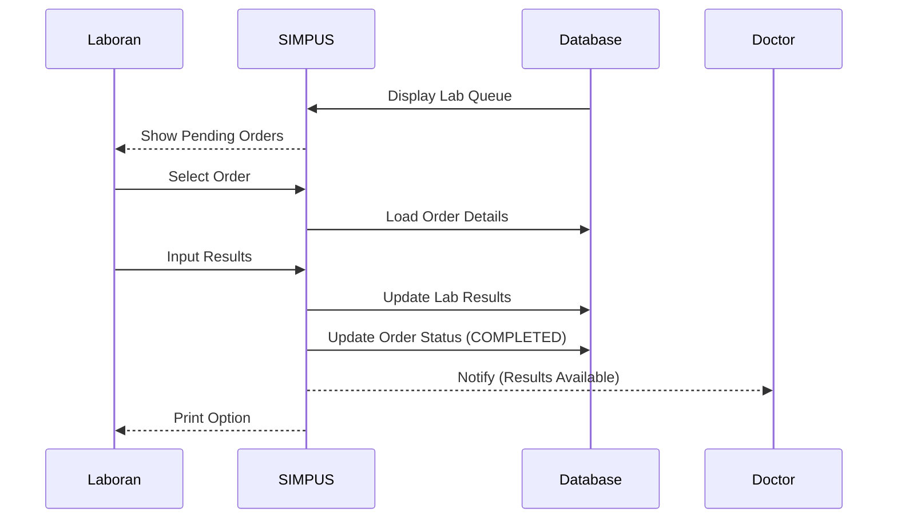

# SIMPUS - System Architecture Documentation

## 📋 Daftar Isi

1. [System Overview](#system-overview)
2. [Technology Stack](#technology-stack)
3. [Architecture Layers](#architecture-layers)
4. [Database Design](#database-design)
5. [Data Flow](#data-flow)
6. [Integration Architecture](#integration-architecture)
7. [Security Architecture](#security-architecture)
8. [Performance Optimization](#performance-optimization)
9. [Deployment Architecture](#deployment-architecture)
10. [Development Guidelines](#development-guidelines)

---

## System Overview

### Purpose
SIMPUS (Sistem Informasi Manajemen Puskesmas) adalah aplikasi web untuk manajemen klinik/puskesmas yang terintegrasi dengan BPJS VClaim dan SATUSEHAT.

### Key Features
- Patient Registration & Management
- Electronic Medical Records (EMR)
- Laboratory Information System (LIS)
- Pharmacy Management System
- Queue Management
- BPJS VClaim Integration
- SATUSEHAT FHIR R4 Integration
- Role-Based Access Control (RBAC)
- Audit Trail & Logging

### System Type
- **Architecture Pattern**: Model-View-Controller (MVC)
- **Development Pattern**: Repository Pattern, Service Layer
- **Integration Pattern**: Queue-based Async Processing
- **Database Pattern**: Relational with soft deletes

---

## Technology Stack

### Backend
- **Framework**: Laravel 12.35.1
- **Language**: PHP 8.2.24
- **ORM**: Eloquent ORM
- **Authentication**: Laravel Session-based Auth
- **Authorization**: Spatie Laravel-Permission (RBAC)
- **Queue**: Database Driver (jobs table)
- **Cache**: Database Driver (cache table)

### Frontend
- **Template Engine**: Blade Templates
- **CSS Framework**: Tailwind CSS 3.x
- **JavaScript**: Alpine.js 3.x (reactive components)
- **Icons**: Heroicons
- **Build Tool**: Vite 6.x

### Database
- **RDBMS**: MySQL 8.0 / MariaDB 10.6+
- **Schema Migrations**: Laravel Migrations
- **Seeding**: Database Seeders & Factories

### Development Tools
- **Package Manager**: Composer 2.x, npm
- **Version Control**: Git
- **Code Style**: Laravel Pint (PHP CS Fixer)
- **Testing**: PHPUnit 11.x
- **API Testing**: Postman Collection

### External Integrations
- **BPJS VClaim**: REST API with HMAC SHA-256
- **SATUSEHAT**: FHIR R4 API with OAuth 2.0

---

## Architecture Layers

### 1. Presentation Layer (UI)
```
resources/views/
├── layouts/
│   ├── app.blade.php         # Main layout
│   └── guest.blade.php       # Guest layout (login)
├── components/               # Reusable Blade components
├── dashboard/                # Dashboard views
├── patients/                 # Patient management
├── visits/                   # Visit/EMR views
├── lab/                      # Lab work queue
├── pharmacy/                 # Pharmacy work queue
└── reports/                  # Reports & analytics
```

**Responsibilities:**
- User interface rendering
- Form validation (client-side)
- Interactive components (Alpine.js)
- Print views (lab results, prescriptions)

### 2. Application Layer (Controllers)
```
app/Http/Controllers/
├── DashboardController.php   # Dashboard metrics
├── PatientController.php     # Patient CRUD
├── VisitController.php       # Visit & EMR
├── LabController.php         # Lab orders & results
├── PrescriptionController.php # Prescriptions
├── QueueController.php       # Queue management
├── ReferralController.php    # Referrals
└── ReportController.php      # Reports & exports
```

**Responsibilities:**
- HTTP request handling
- Input validation (Form Requests)
- Business logic delegation to services
- Response formatting
- Permission checking

### 3. Service Layer
```
app/Services/
├── Bpjs/
│   ├── BpjsService.php       # BPJS VClaim client
│   ├── SepService.php        # SEP operations
│   └── ReferralService.php   # BPJS referral
├── SatuSehat/
│   ├── SatuSehatService.php  # FHIR client
│   ├── FhirTransformer.php   # Data transformer
│   └── SyncService.php       # Sync orchestrator
├── Fhir/
│   └── FhirBuilder.php       # FHIR resource builder
└── Ai/
    └── AiService.php         # AI helper (optional)
```

**Responsibilities:**
- Business logic implementation
- External API communication
- Data transformation
- Transaction management
- Error handling

### 4. Domain Layer (Models)
```
app/Models/
├── User.php                  # System users
├── Patient.php               # Patient data
├── Visit.php                 # Patient visits
├── EmrNote.php               # EMR notes (SOAP)
├── LabOrder.php              # Lab orders
├── LabOrderItem.php          # Lab test items
├── LabOrderResult.php        # Lab results
├── Prescription.php          # Prescriptions
├── PrescriptionItem.php      # Prescription items
├── Medicine.php              # Medicine inventory
├── MasterMedicine.php        # Medicine master data
├── QueueTicket.php           # Queue tickets
├── Referral.php              # Referrals
├── BpjsClaim.php             # BPJS interactions log
├── SyncQueue.php             # Sync queue
└── AuditLog.php              # Audit trail
```

**Responsibilities:**
- Data structure definition
- Business rules (validation, mutators, accessors)
- Relationships definition
- Query scopes
- Model events

### 5. Data Access Layer (Database)
```
database/
├── migrations/               # Schema migrations
│   ├── *_create_users_table.php
│   ├── *_create_patients_table.php
│   ├── *_create_visits_table.php
│   └── ...
├── seeders/                  # Data seeders
│   ├── PermissionSeeder.php
│   ├── UserSeeder.php
│   ├── PatientSeeder.php
│   └── ...
└── factories/                # Model factories
    ├── PatientFactory.php
    ├── VisitFactory.php
    └── ...
```

**Responsibilities:**
- Schema definition
- Default data seeding
- Test data generation

### 6. Integration Layer (Jobs & Queues)
```
app/Jobs/
├── SyncToSatuSehat.php       # Generic SATUSEHAT sync
├── SyncEncounterJob.php      # Encounter sync
└── ...
```

**Responsibilities:**
- Async processing
- External API sync
- Retry logic
- Error handling

---

## Database Design

### Core Tables

#### users (System Users)
- Stores all system users (Admin, Dokter, Lab, Apoteker, Pendaftaran)
- FK to roles via `model_has_roles` (Spatie)

#### patients (Patient Master Data)
- Unique constraints: `medical_record_number`, `nik`, `bpjs_card_no`
- Soft deletes enabled
- Created/updated by users

#### visits (Patient Visits)
- Links patient to provider (doctor)
- Status: `WAITING`, `IN_PROGRESS`, `COMPLETED`, `CANCELLED`
- Coverage type: `BPJS`, `UMUM`
- Soft deletes enabled

#### emr_notes (Electronic Medical Records)
- SOAP format: Subjective, Objective, Assessment, Plan
- ICD-10 diagnosis code
- CASCADE delete with visits

### Clinical Data Tables

#### lab_orders
- Order number (unique)
- Status: `PENDING`, `IN_PROGRESS`, `COMPLETED`, `CANCELLED`
- Priority: `ROUTINE`, `URGENT`, `STAT`
- BPJS and FHIR references

#### lab_order_items
- Test name and LOINC code
- Result, unit, reference range
- Abnormal flag: `NORMAL`, `HIGH`, `LOW`, `CRITICAL`

#### lab_order_results
- Lab results in local format
- CASCADE delete with lab_orders

#### prescriptions
- Status: `PENDING`, `PROCESSED`, `DISPENSED`, `CANCELLED`
- CASCADE delete with visits

#### prescription_items
- Links to `master_medicines`
- Quantity and dosage
- CASCADE delete with prescriptions

### Supporting Tables

#### queue_tickets
- Daily queue number
- Department-based queuing
- Status tracking

#### referrals
- Referral number (unique)
- Status: `PENDING`, `SENT`, `RECEIVED`, `REJECTED`, `COMPLETED`

#### bpjs_claims
- Log all BPJS API interactions
- Store request/response
- Response time tracking

#### sync_queue
- Queue for SATUSEHAT sync
- Target: `satusehat`, `bpjs`
- Status: `PENDING`, `PROCESSING`, `COMPLETED`, `FAILED`
- Retry logic with max attempts

#### audit_logs
- Track all user actions
- Old/new values
- IP address and user agent

### Permission Tables (Spatie)
- `permissions` - Permission list
- `roles` - Role list
- `role_has_permissions` - Role-permission mapping
- `model_has_roles` - User-role mapping (polymorphic)
- `model_has_permissions` - Direct user-permission (polymorphic)

**For detailed ERD**: See [ERD.md](ERD.md)

---

## Data Flow

### Patient Registration Flow


### Doctor EMR Flow


### Lab Workflow


**For detailed DFD**: See [DFD.md](DFD.md)

---

## Integration Architecture

### BPJS VClaim Integration

#### Architecture
```
SIMPUS → BpjsService → BPJS VClaim API
                ↓
           BpjsClaim (Log)
```

#### Features
- **Participant Check**: Validate BPJS card number
- **SEP Management**: Create, update, delete SEP
- **Referral**: BPJS referral management

#### Security
- HMAC SHA-256 signature
- Timestamp validation (max 5 minutes difference)
- Cons ID, Secret Key, User Key

#### Configuration
```env
BPJS_CONS_ID=your_cons_id
BPJS_SECRET=your_secret
BPJS_USER_KEY=your_user_key
BPJS_BASE_URL=https://apijkn.bpjs-kesehatan.go.id/vclaim-rest
```

#### Implementation
```php
app/Services/Bpjs/
├── BpjsService.php       # Main service
├── SepService.php        # SEP operations
└── ReferralService.php   # Referral operations

app/Models/BpjsClaim.php  # Interaction logging
```

### SATUSEHAT FHIR R4 Integration

#### Architecture
```
SIMPUS → Queue (Database) → Queue Worker → SatuSehatService → SATUSEHAT API
                                    ↓
                              SyncQueue (Status)
```

#### Features
- **Patient Resource**: Patient demographics sync
- **Encounter Resource**: Visit/encounter sync
- **Observation Resource**: Lab results sync
- **ServiceRequest Resource**: Lab orders sync

#### Flow
1. Event trigger (patient created, visit completed, lab done)
2. Enqueue sync job to `sync_queue` table
3. Queue worker processes job
4. OAuth 2.0 authentication
5. Transform data to FHIR R4 format
6. POST resource to SATUSEHAT
7. Store resource ID
8. Update sync status

#### Retry Logic
- Max 3 attempts
- Exponential backoff
- Log errors in `sync_queue.last_error`

#### Configuration
```env
SATUSEHAT_CLIENT_ID=your_client_id
SATUSEHAT_CLIENT_SECRET=your_client_secret
SATUSEHAT_BASE_URL=https://api-satusehat.kemkes.go.id/fhir-r4/v1
SATUSEHAT_AUTH_URL=https://api-satusehat.kemkes.go.id/oauth2/v1/accesstoken
SATUSEHAT_ORGANIZATION_ID=your_org_id
```

#### Implementation
```php
app/Services/SatuSehat/
├── SatuSehatService.php  # Main FHIR client
├── FhirTransformer.php   # Data transformer
└── SyncService.php       # Sync orchestrator

app/Jobs/
├── SyncToSatuSehat.php   # Generic sync job
└── SyncEncounterJob.php  # Encounter sync job

app/Models/SyncQueue.php  # Sync queue model
```

#### Queue Worker Command
```bash
php artisan queue:work --queue=default,satusehat
```

---

## Security Architecture

### 1. Authentication
- **Method**: Laravel Session-based Authentication
- **Middleware**: `auth` middleware for protected routes
- **Login**: Email + password
- **Session**: Encrypted session cookies

### 2. Authorization (RBAC)
- **Package**: Spatie Laravel-Permission
- **Roles**: Admin, Dokter, Lab, Apoteker, Pendaftaran
- **Permissions**: CRUD per module (patients, visits, lab, pharmacy, etc.)
- **Middleware**: `permission:`, `role:`

### 3. Audit Trail
- **Model**: `AuditLog`
- **Tracked Actions**: Create, Update, Delete
- **Stored Data**: User, action, entity, old/new values, IP, user agent
- **Helper**: `app/Support/Audit.php`

### 4. Data Protection
- **Encryption**: Sensitive data encrypted in database
- **Hashing**: Passwords hashed with bcrypt
- **Validation**: Input validation via Form Requests
- **SQL Injection**: Prevented by Eloquent ORM and prepared statements

### 5. API Security
- **BPJS**: HMAC signature, timestamp validation
- **SATUSEHAT**: OAuth 2.0, token expiration, secure storage

### 6. XSS & CSRF Protection
- **XSS**: Blade `{{ }}` auto-escapes output
- **CSRF**: CSRF tokens in all forms

---

## Performance Optimization

### 1. Database Optimization
- **Indexes**: 50+ indexes on foreign keys and search columns
- **Composite Indexes**: For frequently joined columns
- **Query Optimization**: Selective column loading (`select()`)
- **Eager Loading**: Prevent N+1 queries (`with()`)

### 2. Caching
- **Driver**: Database cache
- **TTL**: 5-10 minutes for dashboard metrics
- **Cache Keys**: Prefixed by model/module
- **Implementation**:
  ```php
  Cache::remember('dashboard.metrics', 600, function() {
      return $this->calculateMetrics();
  });
  ```

### 3. Queue Processing
- **Driver**: Database queue
- **Workers**: Run async for heavy operations
- **Queues**: `default`, `satusehat`
- **Retry**: 3 attempts with exponential backoff

### 4. Asset Optimization
- **Build Tool**: Vite 6.x
- **CSS**: Tailwind CSS (purged unused classes)
- **JavaScript**: Alpine.js (lightweight, 15KB gzipped)
- **Production Build**: `npm run build`

### 5. Code Optimization
- **Selective Loading**: Only load needed columns
- **Pagination**: 10-50 items per page
- **Lazy Loading**: For large datasets

**For detailed guide**: See [OPTIMASI-PERFORMA.md](OPTIMASI-PERFORMA.md)

---

## Deployment Architecture

### Development Environment
```
Laragon (Windows)
├── Apache 2.4 / Nginx
├── PHP 8.2 FPM
├── MySQL 8.0
└── Adminer / phpMyAdmin
```

### Production Environment (Recommended)
```
Linux Server (Ubuntu 22.04 LTS)
├── Nginx (Reverse Proxy)
├── PHP 8.2 FPM
│   ├── OPcache enabled
│   └── JIT enabled
├── MySQL 8.0 / MariaDB 10.6+
│   └── InnoDB engine
├── Supervisor (Queue Worker)
│   └── php artisan queue:work
└── SSL Certificate (Let's Encrypt)
```

### Deployment Checklist
1. Set `APP_ENV=production` in `.env`
2. Set `APP_DEBUG=false`
3. Run `php artisan config:cache`
4. Run `php artisan route:cache`
5. Run `php artisan view:cache`
6. Run `npm run build` (production assets)
7. Set proper file permissions (storage/, bootstrap/cache/)
8. Configure Supervisor for queue workers
9. Set up SSL certificate
10. Configure backup strategy

### Backup Strategy
- **Database**: Daily automated backup (mysqldump)
- **Files**: Weekly backup of `storage/app/`
- **Retention**: 30 days for daily, 1 year for monthly

---

## Development Guidelines

### Code Style
- **Standard**: Laravel Pint (PHP CS Fixer)
- **Format Command**: `vendor/bin/pint --dirty`
- **PSR-12**: Follow PSR-12 coding standard

### Testing
- **Framework**: PHPUnit 11.x
- **Test Command**: `php artisan test`
- **Factories**: Use factories for test data
- **Coverage**: Aim for 70%+ coverage

### Naming Conventions
- **Controllers**: Singular + `Controller` suffix (e.g., `PatientController`)
- **Models**: Singular PascalCase (e.g., `Patient`)
- **Tables**: Plural snake_case (e.g., `patients`)
- **Foreign Keys**: `{model}_id` (e.g., `patient_id`)
- **Migrations**: Descriptive verb + table (e.g., `create_patients_table`)

### Git Workflow
- **Branches**: `main` (production), `develop` (development)
- **Commit Messages**: Conventional Commits format
  ```
  feat: Add lab print feature
  fix: Fix dashboard date range bug
  docs: Update README with setup instructions
  refactor: Refactor BPJS service
  perf: Add caching to dashboard
  ```

### Code Review Checklist
- [ ] Code follows Laravel conventions
- [ ] No hardcoded credentials
- [ ] Input validation implemented
- [ ] Error handling implemented
- [ ] Audit logging added (if applicable)
- [ ] Tests written and passing
- [ ] Documentation updated

---

## API Documentation

### Postman Collection
- **Location**: `postman/SIMPUS.postman_collection.json`
- **Import**: Import to Postman for testing
- **Environment Variables**:
  - `base_url`: `http://localhost:8000`
  - `token`: Session token (if needed)

### Key Endpoints
- `GET /api/patients` - List patients
- `POST /api/patients` - Create patient
- `GET /api/visits` - List visits
- `POST /api/visits` - Create visit
- `GET /api/lab/orders` - List lab orders
- `POST /api/lab/orders` - Create lab order

---

## Monitoring & Logging

### Application Logs
- **Location**: `storage/logs/laravel.log`
- **Format**: PSR-3 compliant
- **Rotation**: Daily rotation
- **Level**: `debug` (dev), `error` (prod)

### Audit Logs
- **Table**: `audit_logs`
- **Tracked**: User actions, entity changes
- **Retention**: Configurable (default: unlimited)

### Queue Monitoring
- **Table**: `jobs` (pending), `failed_jobs` (failed)
- **Command**: `php artisan queue:failed`
- **Retry**: `php artisan queue:retry {id}`

### Performance Monitoring
- **Laravel Telescope**: (Optional) Install for dev environment
- **Laravel Debugbar**: (Optional) Install for dev environment
- **Query Logging**: Enabled in dev, disabled in prod

---

## References

- [Laravel 12 Documentation](https://laravel.com/docs/12.x)
- [Spatie Laravel-Permission](https://spatie.be/docs/laravel-permission)
- [BPJS VClaim API Documentation](https://dvlp.bpjs-kesehatan.go.id/)
- [SATUSEHAT FHIR R4 Documentation](https://satusehat.kemkes.go.id/platform/docs/id/interoperabilitas/fhir)
- [HL7 FHIR R4 Specification](https://hl7.org/fhir/R4/)
- [Tailwind CSS](https://tailwindcss.com/docs)
- [Alpine.js](https://alpinejs.dev/start-here)

---

## Support & Contribution

### Getting Help
- Check existing documentation first
- Review code examples in the codebase
- Consult Laravel documentation

### Contributing
1. Fork the repository
2. Create feature branch (`git checkout -b feature/amazing-feature`)
3. Commit changes (`git commit -m 'feat: Add amazing feature'`)
4. Push to branch (`git push origin feature/amazing-feature`)
5. Open Pull Request

### Issue Reporting
- Use GitHub Issues
- Provide detailed description
- Include steps to reproduce
- Attach logs if applicable

---

## Changelog

### Version 1.0.0 (Current)
- Initial release
- Patient registration & management
- EMR with SOAP format
- Lab information system
- Pharmacy management
- Queue management
- BPJS VClaim integration
- SATUSEHAT FHIR R4 integration
- Role-based access control
- Audit trail
- Dashboard & reports

---

**Last Updated**: 2025-01-31
**Version**: 1.0.0
**Maintained By**: SIMPUS Development Team
