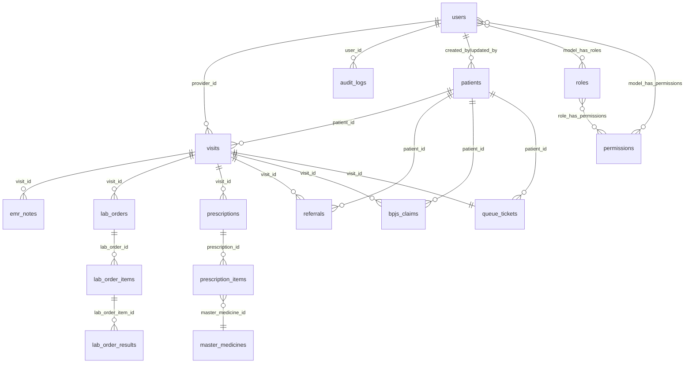

# Database Schema - SIMPUS

## 📊 Entity Relationship Diagram (ERD)

### Overview

Database SIMPUS menggunakan MySQL/MariaDB dengan struktur relasional yang terorganisir untuk mendukung sistem informasi manajemen puskesmas. Database ini dirancang untuk menangani:

- Manajemen pasien dan rekam medis
- Sistem antrian real-time
- Laboratorium dan farmasi
- Integrasi BPJS dan SATUSEHAT
- Audit trail dan tracking

---

## 📋 Table of Contents

- [Core Tables](#core-tables)
  - [users](#users)
  - [patients](#patients)
  - [visits](#visits)
  - [queue_tickets](#queue_tickets)
  - [doctors](#doctors)
- [Medical Records](#medical-records)
  - [emr_notes](#emr_notes)
- [Laboratory](#laboratory)
  - [lab_orders](#lab_orders)
  - [lab_order_items](#lab_order_items)
  - [lab_order_results](#lab_order_results)
- [Pharmacy](#pharmacy)
  - [master_medicines](#master_medicines)
  - [medicines](#medicines)
  - [prescriptions](#prescriptions)
  - [prescription_items](#prescription_items)
- [Integration](#integration)
  - [bpjs_claims](#bpjs_claims)
  - [sync_queue](#sync_queue)
  - [referrals](#referrals)
- [System](#system)
  - [audit_logs](#audit_logs)
  - [permissions & roles](#permissions--roles)
- [Entity Relationships](#entity-relationships)
- [Indexes & Performance](#indexes--performance)

---

## Core Tables

### users

User accounts dengan role-based access control.

| Column | Type | Nullable | Description |
|--------|------|----------|-------------|
| id | bigint UNSIGNED | NO | Primary key |
| name | varchar(255) | NO | Nama lengkap user |
| email | varchar(255) | NO | Email (unique) |
| email_verified_at | timestamp | YES | Email verification timestamp |
| password | varchar(255) | NO | Hashed password |
| remember_token | varchar(100) | YES | Remember me token |
| department | varchar(100) | YES | Department/bagian kerja |
| created_at | timestamp | YES | |
| updated_at | timestamp | YES | |

**Relationships:**
- Has many `visits` (as provider)
- Has many `audit_logs`
- Belongs to many `roles` (via Spatie Permission)
- Belongs to many `permissions` (via Spatie Permission)

**Indexes:**
- PRIMARY KEY (`id`)
- UNIQUE KEY (`email`)

**Roles:**
- Administrator
- Dokter
- Rekam Medis
- Pendaftaran
- Lab
- Apotek

---

### patients

Data master pasien dengan soft deletes.

| Column | Type | Nullable | Description |
|--------|------|----------|-------------|
| id | bigint UNSIGNED | NO | Primary key |
| medical_record_number | varchar(20) | NO | No. RM (unique, auto-generated) |
| nik | varchar(16) | YES | NIK (unique) |
| bpjs_card_no | varchar(13) | YES | No. Kartu BPJS (unique) |
| name | varchar(255) | NO | Nama lengkap pasien |
| date_of_birth | date | NO | Tanggal lahir |
| gender | enum('L','P') | NO | Jenis kelamin (L=Laki-laki, P=Perempuan) |
| blood_type | enum('A','B','AB','O','Unknown') | YES | Golongan darah |
| phone | varchar(20) | YES | No. telepon |
| email | varchar(255) | YES | Email pasien |
| address | text | YES | Alamat lengkap |
| village | varchar(100) | YES | Kelurahan/Desa |
| district | varchar(100) | YES | Kecamatan |
| city | varchar(100) | YES | Kota/Kabupaten |
| province | varchar(100) | YES | Provinsi |
| postal_code | varchar(10) | YES | Kode pos |
| occupation | varchar(100) | YES | Pekerjaan |
| allergies | text | YES | Riwayat alergi |
| emergency_contact_name | varchar(255) | YES | Nama kontak darurat |
| emergency_contact_phone | varchar(20) | YES | No. telp kontak darurat |
| emergency_contact_relation | varchar(50) | YES | Hubungan dengan pasien |
| meta | json | YES | Metadata tambahan (BPJS status, dll) |
| created_by | bigint UNSIGNED | YES | User ID yang membuat |
| updated_by | bigint UNSIGNED | YES | User ID yang mengupdate |
| created_at | timestamp | YES | |
| updated_at | timestamp | YES | |
| deleted_at | timestamp | YES | Soft delete timestamp |

**Relationships:**
- Has many `visits`
- Has one `latestVisit`
- Has many through `emr_notes` (via visits)
- Has many through `lab_orders` (via visits)
- Has many `referrals`
- Has many `bpjs_claims`
- Morph many `sync_queue`
- Belongs to `createdBy` (user)
- Belongs to `updatedBy` (user)

**Indexes:**
- PRIMARY KEY (`id`)
- UNIQUE KEY (`medical_record_number`)
- UNIQUE KEY (`nik`)
- UNIQUE KEY (`bpjs_card_no`)
- INDEX (`name`)
- INDEX (`created_at`)
- INDEX (`deleted_at`)

**Meta JSON Structure:**
```json
{
  "bpjs_status": "AKTIF|TIDAK AKTIF",
  "bpjs_class": "1|2|3",
  "satusehat_id": "patient-fhir-id"
}
```

---

### visits

Data kunjungan pasien dengan soft deletes.

| Column | Type | Nullable | Description |
|--------|------|----------|-------------|
| id | bigint UNSIGNED | NO | Primary key |
| patient_id | bigint UNSIGNED | NO | FK ke patients |
| provider_id | bigint UNSIGNED | YES | FK ke users (dokter) |
| visit_number | varchar(30) | NO | No. kunjungan (unique) |
| visit_datetime | datetime | NO | Waktu kunjungan |
| clinic_name | varchar(100) | YES | Nama poliklinik |
| coverage_type | enum('BPJS','UMUM') | YES | Jenis pembayaran |
| sep_no | varchar(50) | YES | No. SEP BPJS |
| bpjs_reference_no | varchar(50) | YES | No. rujukan BPJS |
| queue_number | varchar(10) | YES | No. antrian |
| status | varchar(20) | YES | Status kunjungan |
| chief_complaint | text | YES | Keluhan utama |
| triage_notes | text | YES | Catatan triage |
| meta | json | YES | Metadata tambahan |
| created_at | timestamp | YES | |
| updated_at | timestamp | YES | |
| deleted_at | timestamp | YES | Soft delete timestamp |

**Relationships:**
- Belongs to `patient`
- Belongs to `provider` (user)
- Has many `emr_notes`
- Has one `latestEmrNote`
- Has many `lab_orders`
- Has many `referrals`
- Has many `bpjs_claims`
- Morph many `sync_queue`
- Has many `prescriptions`
- Has one `queueTicket`

**Indexes:**
- PRIMARY KEY (`id`)
- UNIQUE KEY (`visit_number`)
- INDEX (`patient_id`)
- INDEX (`provider_id`)
- INDEX (`visit_datetime`)
- INDEX (`clinic_name`)
- INDEX (`coverage_type`)
- INDEX (`status`)
- INDEX (`created_at`)
- INDEX (`deleted_at`)

---

### queue_tickets

Sistem antrian pasien per poliklinik.

| Column | Type | Nullable | Description |
|--------|------|----------|-------------|
| id | bigint UNSIGNED | NO | Primary key |
| patient_id | bigint UNSIGNED | NO | FK ke patients |
| visit_id | bigint UNSIGNED | YES | FK ke visits |
| tanggal_antrian | date | NO | Tanggal antrian |
| nomor_antrian | varchar(10) | NO | No. antrian (A001, U001, dll) |
| department | varchar(100) | YES | Poliklinik/Department |
| doctor | varchar(255) | YES | Nama dokter |
| payment_method | enum('BPJS','UMUM') | YES | Metode pembayaran |
| status | enum('MENUNGGU','DIPANGGIL','SELESAI','BATAL') | NO | Status antrian |
| meta | json | YES | Metadata tambahan |
| created_at | timestamp | YES | |
| updated_at | timestamp | YES | |

**Relationships:**
- Belongs to `patient`
- Belongs to `visit`

**Indexes:**
- PRIMARY KEY (`id`)
- INDEX (`patient_id`)
- INDEX (`visit_id`)
- INDEX (`tanggal_antrian`)
- INDEX (`department`)
- INDEX (`status`)

**Status Values:**
- `MENUNGGU` - Pasien menunggu dipanggil
- `DIPANGGIL` - Pasien sedang dipanggil
- `SELESAI` - Antrian selesai
- `BATAL` - Antrian dibatalkan

**Queue Number Format:**
- Format: `[PREFIX][NUMBER]`
- Contoh: `A001`, `U002`, `PM003`
- Prefix ditentukan oleh department

---

### doctors

Master data dokter.

| Column | Type | Nullable | Description |
|--------|------|----------|-------------|
| id | bigint UNSIGNED | NO | Primary key |
| name | varchar(255) | NO | Nama dokter |
| specialist | varchar(100) | YES | Spesialisasi |
| phone | varchar(20) | YES | No. telepon |
| email | varchar(255) | YES | Email |
| license_number | varchar(50) | YES | No. SIP/STR |
| created_at | timestamp | YES | |
| updated_at | timestamp | YES | |

**Indexes:**
- PRIMARY KEY (`id`)
- INDEX (`name`)

---

## Medical Records

### emr_notes

Catatan rekam medis elektronik per kunjungan.

| Column | Type | Nullable | Description |
|--------|------|----------|-------------|
| id | bigint UNSIGNED | NO | Primary key |
| visit_id | bigint UNSIGNED | NO | FK ke visits |
| patient_id | bigint UNSIGNED | NO | FK ke patients |
| subjective | text | YES | Data subjektif (SOAP) |
| objective | text | YES | Data objektif (SOAP) |
| assessment | text | YES | Assessment/diagnosis (SOAP) |
| plan | text | YES | Plan/terapi (SOAP) |
| diagnosis_code | varchar(10) | YES | Kode ICD-10 |
| diagnosis_text | varchar(255) | YES | Teks diagnosis |
| created_by | bigint UNSIGNED | YES | User ID yang membuat |
| created_at | timestamp | YES | |
| updated_at | timestamp | YES | |

**Relationships:**
- Belongs to `visit`
- Belongs to `patient`
- Belongs to `createdBy` (user)

**Indexes:**
- PRIMARY KEY (`id`)
- INDEX (`visit_id`)
- INDEX (`patient_id`)
- INDEX (`diagnosis_code`)

**SOAP Format:**
- **S**ubjective - Keluhan pasien
- **O**bjective - Pemeriksaan fisik, vital signs
- **A**ssessment - Diagnosis
- **P**lan - Rencana terapi

---

## Laboratory

### lab_orders

Order pemeriksaan laboratorium.

| Column | Type | Nullable | Description |
|--------|------|----------|-------------|
| id | bigint UNSIGNED | NO | Primary key |
| visit_id | bigint UNSIGNED | NO | FK ke visits |
| patient_id | bigint UNSIGNED | NO | FK ke patients |
| order_number | varchar(30) | NO | No. order lab (unique) |
| order_datetime | datetime | NO | Waktu order |
| status | enum('PENDING','IN_PROGRESS','COMPLETED','CANCELLED') | NO | Status pemeriksaan |
| notes | text | YES | Catatan tambahan |
| created_by | bigint UNSIGNED | YES | User ID yang order |
| created_at | timestamp | YES | |
| updated_at | timestamp | YES | |

**Relationships:**
- Belongs to `visit`
- Belongs to `patient`
- Belongs to `createdBy` (user)
- Has many `labOrderItems`

**Indexes:**
- PRIMARY KEY (`id`)
- UNIQUE KEY (`order_number`)
- INDEX (`visit_id`)
- INDEX (`patient_id`)
- INDEX (`status`)
- INDEX (`order_datetime`)

---

### lab_order_items

Item pemeriksaan lab per order.

| Column | Type | Nullable | Description |
|--------|------|----------|-------------|
| id | bigint UNSIGNED | NO | Primary key |
| lab_order_id | bigint UNSIGNED | NO | FK ke lab_orders |
| test_name | varchar(255) | NO | Nama pemeriksaan |
| test_code | varchar(20) | YES | Kode pemeriksaan |
| specimen_type | varchar(100) | YES | Jenis spesimen |
| status | varchar(20) | YES | Status item |
| created_at | timestamp | YES | |
| updated_at | timestamp | YES | |

**Relationships:**
- Belongs to `labOrder`
- Has many `labOrderResults`

**Indexes:**
- PRIMARY KEY (`id`)
- INDEX (`lab_order_id`)
- INDEX (`test_code`)

---

### lab_order_results

Hasil pemeriksaan lab.

| Column | Type | Nullable | Description |
|--------|------|----------|-------------|
| id | bigint UNSIGNED | NO | Primary key |
| lab_order_item_id | bigint UNSIGNED | NO | FK ke lab_order_items |
| result_value | text | YES | Nilai hasil |
| unit | varchar(50) | YES | Satuan |
| reference_range | varchar(100) | YES | Nilai normal |
| flag | enum('NORMAL','HIGH','LOW','CRITICAL') | YES | Flag hasil |
| catatan | text | YES | Catatan hasil |
| petugas_lab | varchar(255) | YES | Nama petugas lab |
| resulted_at | datetime | YES | Waktu hasil keluar |
| created_at | timestamp | YES | |
| updated_at | timestamp | YES | |

**Relationships:**
- Belongs to `labOrderItem`

**Indexes:**
- PRIMARY KEY (`id`)
- INDEX (`lab_order_item_id`)
- INDEX (`flag`)

---

## Pharmacy

### master_medicines

Master data obat/alkes.

| Column | Type | Nullable | Description |
|--------|------|----------|-------------|
| id | bigint UNSIGNED | NO | Primary key |
| code | varchar(50) | NO | Kode obat (unique) |
| name | varchar(255) | NO | Nama obat |
| generic_name | varchar(255) | YES | Nama generik |
| category | varchar(100) | YES | Kategori (Tablet, Sirup, dll) |
| unit | varchar(50) | YES | Satuan (Tablet, Botol, dll) |
| strength | varchar(100) | YES | Kekuatan/dosis |
| manufacturer | varchar(255) | YES | Produsen |
| price | decimal(12,2) | YES | Harga satuan |
| stock | int | YES | Stok tersedia |
| minimum_stock | int | YES | Stok minimum |
| description | text | YES | Deskripsi/indikasi |
| is_active | boolean | NO | Status aktif (default: true) |
| created_at | timestamp | YES | |
| updated_at | timestamp | YES | |

**Relationships:**
- Has many `prescriptionItems`

**Indexes:**
- PRIMARY KEY (`id`)
- UNIQUE KEY (`code`)
- INDEX (`name`)
- INDEX (`category`)
- INDEX (`is_active`)

---

### medicines

Legacy table - retained for backward compatibility.

| Column | Type | Nullable | Description |
|--------|------|----------|-------------|
| id | bigint UNSIGNED | NO | Primary key |
| name | varchar(255) | NO | Nama obat |
| type | varchar(100) | YES | Jenis/kategori |
| unit | varchar(50) | YES | Satuan |
| stock | int | YES | Stok |
| price | decimal(10,2) | YES | Harga |
| created_at | timestamp | YES | |
| updated_at | timestamp | YES | |

**Indexes:**
- PRIMARY KEY (`id`)

---

### prescriptions

Resep obat per kunjungan.

| Column | Type | Nullable | Description |
|--------|------|----------|-------------|
| id | bigint UNSIGNED | NO | Primary key |
| visit_id | bigint UNSIGNED | NO | FK ke visits |
| prescription_number | varchar(30) | NO | No. resep (unique) |
| prescription_date | date | NO | Tanggal resep |
| doctor_name | varchar(255) | YES | Nama dokter |
| status | enum('PENDING','DISPENSED','CANCELLED') | NO | Status resep |
| notes | text | YES | Catatan apoteker |
| created_by | bigint UNSIGNED | YES | User ID yang buat |
| dispensed_by | bigint UNSIGNED | YES | User ID apoteker |
| dispensed_at | datetime | YES | Waktu dispensing |
| created_at | timestamp | YES | |
| updated_at | timestamp | YES | |

**Relationships:**
- Belongs to `visit`
- Belongs to `createdBy` (user)
- Belongs to `dispensedBy` (user)
- Has many `prescriptionItems`

**Indexes:**
- PRIMARY KEY (`id`)
- UNIQUE KEY (`prescription_number`)
- INDEX (`visit_id`)
- INDEX (`status`)
- INDEX (`prescription_date`)

---

### prescription_items

Item obat per resep.

| Column | Type | Nullable | Description |
|--------|------|----------|-------------|
| id | bigint UNSIGNED | NO | Primary key |
| prescription_id | bigint UNSIGNED | NO | FK ke prescriptions |
| master_medicine_id | bigint UNSIGNED | YES | FK ke master_medicines |
| medicine_name | varchar(255) | NO | Nama obat |
| dosage | varchar(100) | YES | Dosis (1x1, 3x1, dll) |
| quantity | int | NO | Jumlah |
| unit | varchar(50) | YES | Satuan |
| instructions | text | YES | Aturan pakai |
| notes | text | YES | Catatan |
| created_at | timestamp | YES | |
| updated_at | timestamp | YES | |

**Relationships:**
- Belongs to `prescription`
- Belongs to `masterMedicine`

**Indexes:**
- PRIMARY KEY (`id`)
- INDEX (`prescription_id`)
- INDEX (`master_medicine_id`)

---

## Integration

### bpjs_claims

Data klaim BPJS dan SEP.

| Column | Type | Nullable | Description |
|--------|------|----------|-------------|
| id | bigint UNSIGNED | NO | Primary key |
| visit_id | bigint UNSIGNED | YES | FK ke visits |
| patient_id | bigint UNSIGNED | YES | FK ke patients |
| sep_no | varchar(50) | NO | No. SEP (unique) |
| bpjs_card_no | varchar(13) | YES | No. kartu BPJS |
| treatment_class | varchar(2) | YES | Kelas rawat (1/2/3) |
| diagnosis | varchar(255) | YES | Diagnosis |
| poly_code | varchar(10) | YES | Kode poli |
| poly_name | varchar(100) | YES | Nama poli |
| reference_no | varchar(50) | YES | No. rujukan |
| reference_date | date | YES | Tanggal rujukan |
| reference_faskes_code | varchar(20) | YES | Kode faskes rujukan |
| reference_faskes_name | varchar(255) | YES | Nama faskes rujukan |
| sep_date | date | YES | Tanggal SEP |
| plan_date | date | YES | Tanggal rencana |
| accident_location | varchar(255) | YES | Lokasi kecelakaan |
| accident_date | date | YES | Tanggal kecelakaan |
| status | varchar(20) | YES | Status SEP |
| response | json | YES | Response dari BPJS API |
| created_at | timestamp | YES | |
| updated_at | timestamp | YES | |

**Relationships:**
- Belongs to `visit`
- Belongs to `patient`

**Indexes:**
- PRIMARY KEY (`id`)
- UNIQUE KEY (`sep_no`)
- INDEX (`visit_id`)
- INDEX (`patient_id`)
- INDEX (`bpjs_card_no`)
- INDEX (`status`)

---

### sync_queue

Queue sinkronisasi ke SATUSEHAT FHIR.

| Column | Type | Nullable | Description |
|--------|------|----------|-------------|
| id | bigint UNSIGNED | NO | Primary key |
| entity_type | varchar(255) | NO | Polymorphic type (Patient, Visit, dll) |
| entity_id | bigint UNSIGNED | NO | Polymorphic ID |
| resource_type | varchar(50) | NO | FHIR resource type (Patient, Encounter, dll) |
| action | enum('CREATE','UPDATE','DELETE') | NO | Aksi sync |
| status | enum('PENDING','PROCESSING','COMPLETED','FAILED') | NO | Status sync |
| fhir_id | varchar(255) | YES | ID dari SATUSEHAT |
| payload | json | YES | Data yang dikirim |
| response | json | YES | Response dari SATUSEHAT |
| error_message | text | YES | Error message jika gagal |
| attempts | int | NO | Jumlah percobaan (default: 0) |
| last_attempted_at | datetime | YES | Waktu percobaan terakhir |
| completed_at | datetime | YES | Waktu selesai |
| created_at | timestamp | YES | |
| updated_at | timestamp | YES | |

**Relationships:**
- Morph to `entity` (Patient, Visit, dll)

**Indexes:**
- PRIMARY KEY (`id`)
- INDEX (`entity_type`, `entity_id`)
- INDEX (`resource_type`)
- INDEX (`status`)
- INDEX (`action`)

**FHIR Resource Types:**
- `Patient` - Data pasien
- `Encounter` - Data kunjungan
- `Observation` - Hasil lab, vital signs
- `Condition` - Diagnosis
- `MedicationRequest` - Resep obat

---

### referrals

Data rujukan internal/eksternal.

| Column | Type | Nullable | Description |
|--------|------|----------|-------------|
| id | bigint UNSIGNED | NO | Primary key |
| visit_id | bigint UNSIGNED | YES | FK ke visits |
| patient_id | bigint UNSIGNED | NO | FK ke patients |
| referral_number | varchar(30) | NO | No. rujukan (unique) |
| referral_type | enum('INTERNAL','EXTERNAL') | NO | Tipe rujukan |
| from_clinic | varchar(100) | YES | Dari klinik |
| to_clinic | varchar(100) | YES | Ke klinik |
| to_facility | varchar(255) | YES | Ke faskes (untuk eksternal) |
| referral_date | date | NO | Tanggal rujukan |
| diagnosis | varchar(255) | YES | Diagnosis |
| notes | text | YES | Catatan rujukan |
| status | varchar(20) | YES | Status |
| created_by | bigint UNSIGNED | YES | User ID yang buat |
| created_at | timestamp | YES | |
| updated_at | timestamp | YES | |

**Relationships:**
- Belongs to `visit`
- Belongs to `patient`
- Belongs to `createdBy` (user)

**Indexes:**
- PRIMARY KEY (`id`)
- UNIQUE KEY (`referral_number`)
- INDEX (`visit_id`)
- INDEX (`patient_id`)
- INDEX (`referral_type`)
- INDEX (`status`)

---

## System

### audit_logs

Audit trail untuk tracking semua aktivitas.

| Column | Type | Nullable | Description |
|--------|------|----------|-------------|
| id | bigint UNSIGNED | NO | Primary key |
| user_id | bigint UNSIGNED | YES | FK ke users |
| action | varchar(50) | NO | Aksi (CREATE, UPDATE, DELETE, dll) |
| model | varchar(255) | YES | Model name |
| model_id | bigint UNSIGNED | YES | ID record yang diakses |
| changes | json | YES | Data perubahan (before/after) |
| ip_address | varchar(45) | YES | IP address user |
| user_agent | text | YES | Browser user agent |
| status | varchar(20) | YES | Status aksi |
| created_at | timestamp | YES | |
| updated_at | timestamp | YES | |

**Relationships:**
- Belongs to `user`

**Indexes:**
- PRIMARY KEY (`id`)
- INDEX (`user_id`)
- INDEX (`action`)
- INDEX (`model`)
- INDEX (`created_at`)

**Action Types:**
- `LOGIN` - User login
- `LOGOUT` - User logout
- `CREATE` - Create record
- `UPDATE` - Update record
- `DELETE` - Delete record
- `VIEW` - View record
- `EXPORT` - Export data

---

### permissions & roles

Spatie Laravel Permission tables.

#### roles

| Column | Type | Description |
|--------|------|-------------|
| id | bigint UNSIGNED | Primary key |
| name | varchar(255) | Role name (unique) |
| guard_name | varchar(255) | Guard name |
| created_at | timestamp | |
| updated_at | timestamp | |

#### permissions

| Column | Type | Description |
|--------|------|-------------|
| id | bigint UNSIGNED | Primary key |
| name | varchar(255) | Permission name (unique) |
| guard_name | varchar(255) | Guard name |
| created_at | timestamp | |
| updated_at | timestamp | |

#### model_has_roles

Many-to-many pivot table untuk user-roles.

| Column | Type | Description |
|--------|------|-------------|
| role_id | bigint UNSIGNED | FK ke roles |
| model_type | varchar(255) | Model type (User) |
| model_id | bigint UNSIGNED | User ID |

#### model_has_permissions

Many-to-many pivot table untuk user-permissions.

| Column | Type | Description |
|--------|------|-------------|
| permission_id | bigint UNSIGNED | FK ke permissions |
| model_type | varchar(255) | Model type (User) |
| model_id | bigint UNSIGNED | User ID |

#### role_has_permissions

Many-to-many pivot table untuk role-permissions.

| Column | Type | Description |
|--------|------|-------------|
| permission_id | bigint UNSIGNED | FK ke permissions |
| role_id | bigint UNSIGNED | FK ke roles |

---

## Entity Relationships

### ERD Diagram (Mermaid)



### Detailed Relationship Summary

#### Patient Centric
```
patients (1) ----< (N) visits
patients (1) ----< (N) referrals
patients (1) ----< (N) bpjs_claims
patients (1) ----< (N) queue_tickets
patients (1) ----> (N) sync_queue (polymorphic)
```

#### Visit Centric
```
visits (1) ----< (N) emr_notes
visits (1) ----< (N) lab_orders
visits (1) ----< (N) prescriptions
visits (1) ----< (N) referrals
visits (1) ----< (N) bpjs_claims
visits (1) ---- (1) queue_tickets
visits (1) ----> (N) sync_queue (polymorphic)
```

#### Laboratory Flow
```
lab_orders (1) ----< (N) lab_order_items
lab_order_items (1) ----< (N) lab_order_results
```

#### Pharmacy Flow
```
prescriptions (1) ----< (N) prescription_items
prescription_items (N) ----< (1) master_medicines
```

#### User & Security
```
users (N) ----< (N) roles (via model_has_roles)
users (N) ----< (N) permissions (via model_has_permissions)
roles (N) ----< (N) permissions (via role_has_permissions)
```

---

## Indexes & Performance

### Critical Indexes

#### High-Traffic Queries
```sql
-- patients table
INDEX idx_patients_name (name);
INDEX idx_patients_nik (nik);
INDEX idx_patients_bpjs (bpjs_card_no);
INDEX idx_patients_created_at (created_at);

-- visits table
INDEX idx_visits_patient_id (patient_id);
INDEX idx_visits_datetime (visit_datetime);
INDEX idx_visits_clinic (clinic_name);
INDEX idx_visits_status (status);

-- queue_tickets table
INDEX idx_queue_date_dept (tanggal_antrian, department);
INDEX idx_queue_status (status);

-- lab_orders table
INDEX idx_lab_status_datetime (status, order_datetime);

-- prescriptions table
INDEX idx_prescription_status_date (status, prescription_date);
```

### Composite Indexes

```sql
-- For queue number generation (performance critical)
INDEX idx_queue_date_dept_number (tanggal_antrian, department, nomor_antrian);

-- For visit searches
INDEX idx_visit_patient_datetime (patient_id, visit_datetime);

-- For BPJS claims
INDEX idx_bpjs_patient_status (patient_id, status);

-- For sync queue processing
INDEX idx_sync_status_type (status, resource_type);
```

---

## Database Conventions

### Naming Conventions
- **Tables**: Plural, snake_case (e.g., `patients`, `lab_orders`)
- **Columns**: snake_case (e.g., `medical_record_number`, `created_at`)
- **Foreign Keys**: `{table_singular}_id` (e.g., `patient_id`, `visit_id`)
- **Timestamps**: Laravel standard (`created_at`, `updated_at`, `deleted_at`)
- **JSON columns**: Named `meta` for flexible metadata, specific names for structured JSON

### Data Types
- **IDs**: `bigint UNSIGNED` (Laravel standard)
- **Strings**: `varchar(255)` default, specific lengths for codes/numbers
- **Text**: `text` for long content
- **Enums**: Used for fixed value sets (gender, status, etc.)
- **JSON**: For flexible/dynamic data (meta fields, API responses)
- **Decimals**: `decimal(12,2)` for currency, `decimal(10,2)` for other numbers
- **Timestamps**: Laravel timestamps with timezone support

### Soft Deletes
Tables with soft deletes:
- `patients` - untuk data historis
- `visits` - untuk audit trail kunjungan
- `emr_notes` - untuk rekam medis (tidak boleh hilang permanent)

### JSON Metadata Pattern
Many tables include a `meta` JSON column for:
- Extensibility without schema changes
- Integration-specific data (BPJS, SATUSEHAT)
- Temporary/dynamic attributes
- Custom fields per implementation

---

## Migration Order

Migrasi harus dijalankan dalam urutan yang benar untuk menghindari foreign key constraint errors:

1. Core tables: `users`, `cache`, `jobs`
2. Permission tables (Spatie)
3. `patients`
4. `doctors`
5. `visits`
6. `queue_tickets`
7. `emr_notes`
8. `lab_orders`, `lab_order_items`, `lab_order_results`
9. `master_medicines`, `medicines`
10. `prescriptions`, `prescription_items`
11. `referrals`
12. `bpjs_claims`
13. `sync_queue`
14. `audit_logs`
15. Index optimization migrations

---

## Database Size Estimates

For planning purposes:

| Table | Rows/Year | Size/Row | Estimated Size/Year |
|-------|-----------|----------|---------------------|
| patients | ~10,000 | 2 KB | ~20 MB |
| visits | ~50,000 | 1 KB | ~50 MB |
| queue_tickets | ~50,000 | 500 B | ~25 MB |
| emr_notes | ~50,000 | 2 KB | ~100 MB |
| lab_orders | ~20,000 | 500 B | ~10 MB |
| lab_order_results | ~100,000 | 300 B | ~30 MB |
| prescriptions | ~40,000 | 500 B | ~20 MB |
| audit_logs | ~500,000 | 500 B | ~250 MB |

**Total estimated growth**: ~500 MB - 1 GB per year for medium-sized puskesmas.

---

## Backup & Maintenance

### Recommended Backup Strategy

```bash
# Daily full backup
mysqldump -u root -p simpus > simpus_backup_$(date +%Y%m%d).sql

# Weekly backup with compression
mysqldump -u root -p simpus | gzip > simpus_backup_$(date +%Y%m%d).sql.gz
```

### Maintenance Tasks

```sql
-- Optimize tables (monthly)
OPTIMIZE TABLE patients, visits, emr_notes, lab_orders, prescriptions;

-- Analyze tables for query optimization (weekly)
ANALYZE TABLE patients, visits, queue_tickets;

-- Clean old audit logs (yearly, keep last 2 years)
DELETE FROM audit_logs WHERE created_at < DATE_SUB(NOW(), INTERVAL 2 YEAR);

-- Archive old queue tickets (monthly, keep last 3 months)
DELETE FROM queue_tickets WHERE tanggal_antrian < DATE_SUB(CURDATE(), INTERVAL 3 MONTH);
```

---

## See Also

- [Architecture & DFD](ARCHITECTURE.md)
- [BPJS Integration](BPJS-INTEGRATION.md)
- [SATUSEHAT Integration](SATUSEHAT-INTEGRATION.md)
- [Development Guide](DEVELOPMENT-GUIDE.md)
