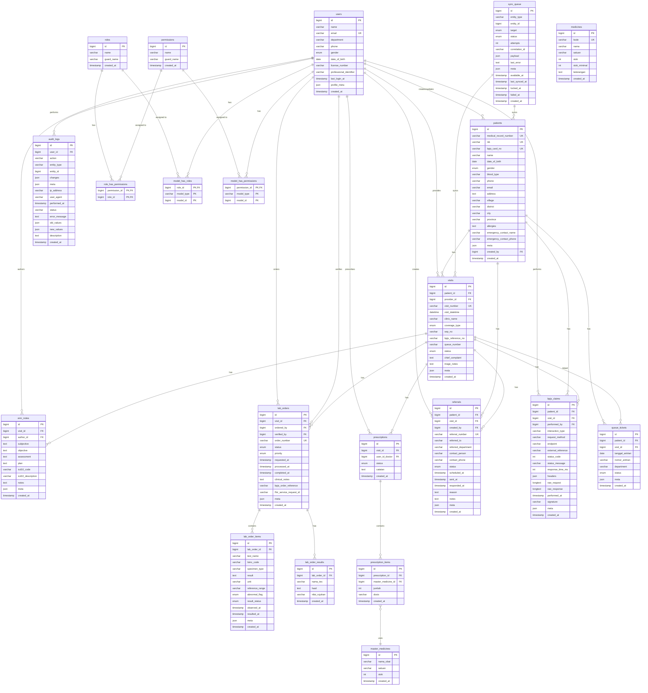

# Entity Relationship Diagram (ERD) - SIMPUS

## Diagram ERD

## Penjelasan Relasi

### 1. Core Entities

#### Users (Pengguna Sistem)
- **Relasi ke Patients**: One-to-Many (1:N)
  - Satu user dapat membuat/mengupdate banyak pasien
  - FK: `patients.created_by`, `patients.updated_by`

- **Relasi ke Visits**: One-to-Many (1:N)
  - Satu provider (dokter) dapat menangani banyak kunjungan
  - FK: `visits.provider_id`

- **Relasi ke EMR Notes**: One-to-Many (1:N)
  - Satu dokter dapat menulis banyak catatan EMR
  - FK: `emr_notes.author_id`

- **Relasi ke Lab Orders**: One-to-Many (1:N)
  - Satu dokter dapat membuat banyak order lab
  - Satu laboran dapat memverifikasi banyak order lab
  - FK: `lab_orders.ordered_by`, `lab_orders.verified_by`

- **Relasi ke Prescriptions**: One-to-Many (1:N)
  - Satu dokter dapat membuat banyak resep
  - FK: `prescriptions.user_id_doctor`

### 2. Patient Journey Flow

#### Patients → Visits
- **Relasi**: One-to-Many (1:N)
- Satu pasien dapat memiliki banyak kunjungan
- FK: `visits.patient_id`
- ON DELETE: CASCADE (jika pasien dihapus, semua kunjungan ikut terhapus)

#### Visits → Clinical Data
- **EMR Notes** (1:N): Satu kunjungan dapat memiliki banyak catatan EMR
- **Lab Orders** (1:N): Satu kunjungan dapat memiliki banyak order lab
- **Prescriptions** (1:N): Satu kunjungan dapat memiliki banyak resep
- **Queue Tickets** (1:1): Satu kunjungan terhubung dengan satu nomor antrian
- **Referrals** (1:N): Satu kunjungan dapat menghasilkan banyak rujukan

### 3. Lab System

#### Lab Orders → Lab Order Items
- **Relasi**: One-to-Many (1:N)
- Satu order lab dapat berisi banyak tes/item
- FK: `lab_order_items.lab_order_id`
- ON DELETE: CASCADE

#### Lab Orders → Lab Order Results
- **Relasi**: One-to-Many (1:N)
- Satu order lab dapat memiliki banyak hasil
- FK: `lab_order_results.lab_order_id`
- ON DELETE: CASCADE

### 4. Pharmacy System

#### Prescriptions → Prescription Items
- **Relasi**: One-to-Many (1:N)
- Satu resep dapat berisi banyak item obat
- FK: `prescription_items.prescription_id`
- ON DELETE: CASCADE

#### Prescription Items → Master Medicines
- **Relasi**: Many-to-One (N:1)
- Banyak prescription item menggunakan satu master obat
- FK: `prescription_items.master_medicine_id`
- ON DELETE: CASCADE

### 5. Integration System

#### Sync Queue
- **Relasi ke berbagai entitas**:
  - Entity type: `Visit`, `Patient`, `Encounter`, dll
  - Entity ID: Foreign key polymorphic ke berbagai tabel
  - Target: `satusehat`, `bpjs`
  - Status: `pending`, `processing`, `completed`, `failed`

#### BPJS Claims
- **Relasi ke Patients**: Many-to-One (N:1)
- **Relasi ke Visits**: Many-to-One (N:1)
- **Relasi ke Users**: Many-to-One (N:1)
- Mencatat semua interaksi dengan BPJS VClaim API

### 6. Spatie Permission System (RBAC)

#### Role-Based Access Control
- **Roles** → **Permissions**: Many-to-Many (N:M)
  - Pivot table: `role_has_permissions`
  
- **Users** → **Roles**: Many-to-Many (N:M)
  - Pivot table: `model_has_roles` (polymorphic)
  
- **Users** → **Permissions**: Many-to-Many (N:M)
  - Pivot table: `model_has_permissions` (polymorphic, untuk direct permission)

## Status Values

### Visit Status
- `WAITING` - Menunggu di antrian
- `IN_PROGRESS` - Sedang diperiksa
- `COMPLETED` - Selesai diperiksa
- `CANCELLED` - Dibatalkan

### Lab Order Status
- `PENDING` - Menunggu diproses
- `IN_PROGRESS` - Sedang diproses
- `COMPLETED` - Selesai dengan hasil
- `CANCELLED` - Dibatalkan

### Prescription Status
- `PENDING` - Menunggu diproses apoteker
- `PROCESSED` - Sudah diproses
- `DISPENSED` - Sudah diserahkan ke pasien
- `CANCELLED` - Dibatalkan

### Queue Ticket Status
- `WAITING` - Menunggu dipanggil
- `CALLED` - Sedang dipanggil
- `COMPLETED` - Selesai dilayani
- `SKIPPED` - Dilewati
- `CANCELLED` - Dibatalkan

### Referral Status
- `PENDING` - Menunggu dikirim
- `SENT` - Sudah dikirim
- `RECEIVED` - Sudah diterima faskes tujuan
- `REJECTED` - Ditolak
- `COMPLETED` - Selesai ditangani

### Sync Queue Status
- `PENDING` - Menunggu disync
- `PROCESSING` - Sedang disync
- `COMPLETED` - Berhasil disync
- `FAILED` - Gagal disync

### Sync Queue Target
- `satusehat` - Sync ke SATUSEHAT FHIR
- `bpjs` - Sync ke BPJS VClaim

## Coverage Type (Jenis Pembayaran)
- `BPJS` - Pasien BPJS/JKN
- `UMUM` - Pasien umum/mandiri

## Gender
- `MALE` - Laki-laki
- `FEMALE` - Perempuan

## Lab Priority
- `ROUTINE` - Pemeriksaan rutin
- `URGENT` - Mendesak
- `STAT` - Segera (emergency)

## Lab Abnormal Flag
- `NORMAL` - Hasil normal
- `HIGH` - Di atas nilai normal
- `LOW` - Di bawah nilai normal
- `CRITICAL` - Kritis (memerlukan tindakan segera)

## Key Indexes

### Performance Indexes
- `patients.medical_record_number` (UNIQUE)
- `patients.nik` (UNIQUE)
- `patients.bpjs_card_no` (UNIQUE)
- `visits.visit_number` (UNIQUE)
- `visits.visit_datetime` + `coverage_type` (COMPOSITE)
- `lab_orders.order_number` (UNIQUE)
- `lab_orders.visit_id` + `status` (COMPOSITE)
- `queue_tickets.tanggal_antrian` + `nomor_antrian` (UNIQUE COMPOSITE)
- `sync_queue.entity_type` + `entity_id` (COMPOSITE)
- `sync_queue.target` + `status` (COMPOSITE)
- `bpjs_claims.interaction_type` + `endpoint` (COMPOSITE)

### Foreign Key Indexes
- Semua foreign key memiliki index otomatis untuk query join yang cepat

## Soft Deletes
Tabel-tabel berikut menggunakan soft delete (`deleted_at` column):
- `patients`
- `visits`
- `lab_orders`

## JSON Meta Fields
Banyak tabel memiliki kolom `meta` (JSON) untuk menyimpan data tambahan yang fleksibel:
- `users.profile_meta`
- `patients.meta`
- `visits.meta`
- `emr_notes.meta`
- `lab_orders.meta`
- `lab_order_items.meta`
- `queue_tickets.meta`
- `referrals.meta`
- `bpjs_claims.meta`
- `sync_queue.meta`
- `audit_logs.meta`

## Audit Trail
Sistem menggunakan `audit_logs` untuk mencatat semua perubahan data penting:
- User yang melakukan aksi
- Jenis aksi (create, update, delete, dll)
- Entity yang diubah
- Nilai lama dan baru
- IP address dan user agent
- Timestamp

## Integration References
- **BPJS**: `visits.sep_no`, `visits.bpjs_reference_no`, `lab_orders.bpjs_order_reference`
- **FHIR/SATUSEHAT**: `lab_orders.fhir_service_request_id`
- **Correlation ID**: `sync_queue.correlation_id` untuk tracing

## Notes
- Semua tabel memiliki `created_at` dan `updated_at` (timestamps)
- Foreign key dengan ON DELETE SET NULL: untuk data reference yang perlu dipertahankan
- Foreign key dengan ON DELETE CASCADE: untuk data dependent yang harus ikut terhapus
- Unique constraints untuk mencegah duplikasi data kritis
- Composite indexes untuk query yang sering digunakan bersama
