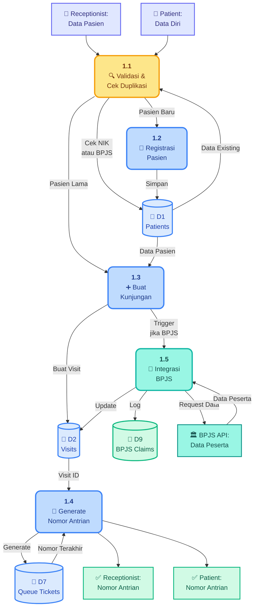
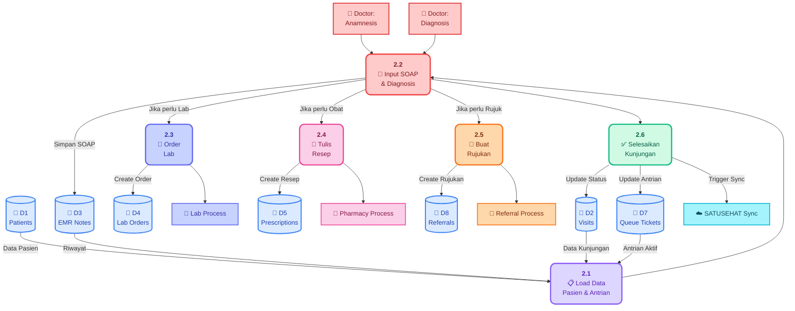
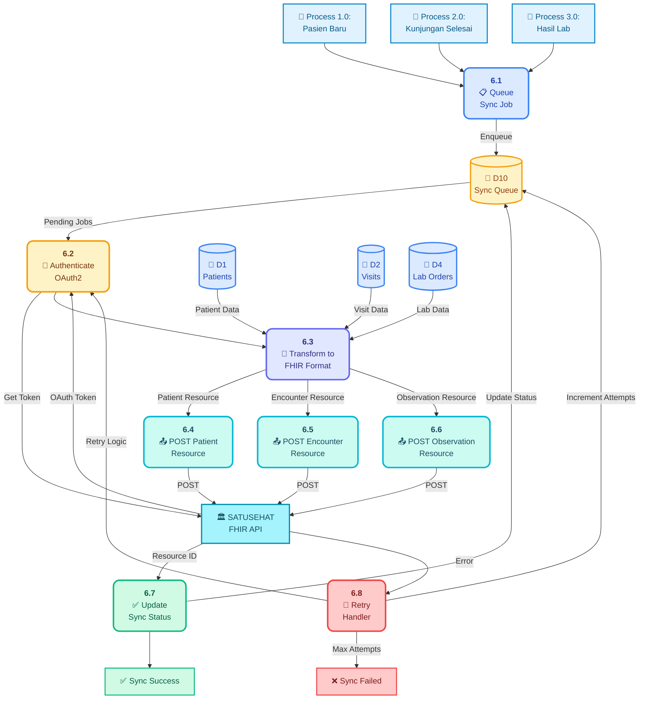
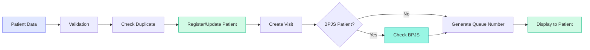
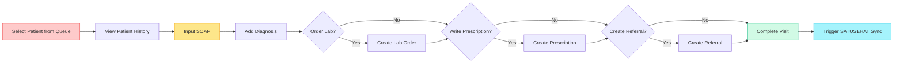

# 📊 Data Flow Diagram (DFD) - SIMPUS

<div align="center">

**Sistem Informasi Manajemen Puskesmas**
*Healthcare Information Management System*

---

[](LICENSE)
[](https://laravel.com)
[](https://hl7.org/fhir/R4/)

</div>

---

## 📑 Table of Contents

- [DFD Level 0 (Context Diagram)](#-dfd-level-0-context-diagram)
- [DFD Level 1 (Process Diagram)](#-dfd-level-1-process-diagram)
- [DFD Level 2: Detail Process 1.0](#-dfd-level-2-detail-process-10-pendaftaran--antrian)
- [DFD Level 2: Detail Process 2.0](#-dfd-level-2-detail-process-20-rekam-medis-elektronik)
- [DFD Level 2: Detail Process 6.0](#-dfd-level-2-detail-process-60-sinkronisasi-satusehat)
- [Penjelasan Proses](#-penjelasan-proses)
- [Data Flows Detail](#-data-flows-detail)
- [System Characteristics](#-system-characteristics)

---

## 🎯 DFD Level 0 (Context Diagram)

Diagram konteks menunjukkan interaksi sistem SIMPUS dengan entitas eksternal (pengguna dan sistem luar).

```mermaid
flowchart TB
    %% External Entities
    Admin["👤 Admin<br/><small>System Administrator</small>"]
    Receptionist["👤 Receptionist<br/><small>Front Desk</small>"]
    Doctor["👤 Dokter<br/><small>Medical Doctor</small>"]
    Lab["👤 Laboran<br/><small>Laboratory Staff</small>"]
    Pharmacist["👤 Apoteker<br/><small>Pharmacist</small>"]
    Patient["👥 Pasien<br/><small>Patient</small>"]
    BPJS["🏛️ BPJS<br/><small>VClaim API</small>"]
    SATUSEHAT["🏛️ SATUSEHAT<br/><small>FHIR R4 API</small>"]

    %% Main System
    SIMPUS[("⚕️ SIMPUS<br/><b>Sistem Informasi</b><br/><b>Manajemen Puskesmas</b>")]

    %% Data Flows - Admin
    Admin -->|"Kelola User, Roles<br/>& Permissions"| SIMPUS
    Admin -->|"Kelola Master<br/>Data Obat"| SIMPUS
    SIMPUS -->|"Laporan &<br/>Audit Log"| Admin

    %% Data Flows - Receptionist
    Receptionist -->|"Data Pendaftaran<br/>Pasien"| SIMPUS
    SIMPUS -->|"Data Pasien<br/>& Jadwal"| Receptionist
    SIMPUS -->|"Nomor Antrian"| Receptionist

    %% Data Flows - Doctor
    Doctor -->|"Anamnesis &<br/>Diagnosis"| SIMPUS
    Doctor -->|"Order Lab,<br/>Resep, Rujukan"| SIMPUS
    SIMPUS -->|"Data Pasien &<br/>Riwayat Medis"| Doctor
    SIMPUS -->|"Hasil Lab &<br/>Antrian Pasien"| Doctor

    %% Data Flows - Lab
    Lab -->|"Hasil Pemeriksaan<br/>Lab"| SIMPUS
    SIMPUS -->|"Order Lab &<br/>Data Pasien"| Lab

    %% Data Flows - Pharmacist
    Pharmacist -->|"Status Resep &<br/>Update Stok"| SIMPUS
    SIMPUS -->|"Resep Dokter &<br/>Data Obat"| Pharmacist

    %% Data Flows - Patient
    Patient -->|"Data Diri &<br/>Keluhan"| SIMPUS
    SIMPUS -->|"Nomor Antrian<br/>Hasil Lab & Resep"| Patient

    %% Data Flows - BPJS
    SIMPUS -->|"Cek Peserta,<br/>Buat/Update SEP"| BPJS
    BPJS -->|"Data Peserta,<br/>Nomor SEP"| SIMPUS

    %% Data Flows - SATUSEHAT
    SIMPUS -->|"FHIR Resources<br/>(Patient, Encounter)"| SATUSEHAT
    SATUSEHAT -->|"Resource ID &<br/>OAuth Token"| SIMPUS

    %% Modern Styling
    style SIMPUS fill:#2563eb,stroke:#1e40af,stroke-width:5px,color:#fff,rx:20,ry:20
    style Admin fill:#f59e0b,stroke:#d97706,stroke-width:3px,color:#000,rx:10,ry:10
    style Receptionist fill:#10b981,stroke:#059669,stroke-width:3px,color:#fff,rx:10,ry:10
    style Doctor fill:#ef4444,stroke:#dc2626,stroke-width:3px,color:#fff,rx:10,ry:10
    style Lab fill:#8b5cf6,stroke:#7c3aed,stroke-width:3px,color:#fff,rx:10,ry:10
    style Pharmacist fill:#ec4899,stroke:#db2777,stroke-width:3px,color:#fff,rx:10,ry:10
    style Patient fill:#6366f1,stroke:#4f46e5,stroke-width:3px,color:#fff,rx:10,ry:10
    style BPJS fill:#14b8a6,stroke:#0d9488,stroke-width:3px,color:#fff,rx:10,ry:10
    style SATUSEHAT fill:#06b6d4,stroke:#0891b2,stroke-width:3px,color:#fff,rx:10,ry:10
```



---

## 🔄 DFD Level 1 (Process Diagram)

Diagram proses menunjukkan detail proses utama dalam sistem, data stores, dan alur data antar proses.

```mermaid
flowchart TB
    %% External Entities
    Receptionist["👤 Receptionist"]
    Doctor["👤 Dokter"]
    Lab["👤 Laboran"]
    Pharmacist["👤 Apoteker"]
    Patient["👥 Pasien"]
    BPJS["🏛️ BPJS API"]
    SATUSEHAT["🏛️ SATUSEHAT API"]

    %% Main Processes
    P1["<b>1.0</b><br/>📝 Pendaftaran<br/>& Antrian"]
    P2["<b>2.0</b><br/>🏥 Rekam Medis<br/>Elektronik"]
    P3["<b>3.0</b><br/>🔬 Pemeriksaan<br/>Laboratorium"]
    P4["<b>4.0</b><br/>💊 Resep<br/>& Farmasi"]
    P5["<b>5.0</b><br/>🔗 Integrasi<br/>BPJS"]
    P6["<b>6.0</b><br/>☁️ Sinkronisasi<br/>SATUSEHAT"]
    P7["<b>7.0</b><br/>📄 Rujukan<br/>Pasien"]

    %% Data Stores
    DS1[("💾 D1<br/>Patients")]
    DS2[("💾 D2<br/>Visits")]
    DS3[("💾 D3<br/>EMR Notes")]
    DS4[("💾 D4<br/>Lab Orders")]
    DS5[("💾 D5<br/>Prescriptions")]
    DS6[("💾 D6<br/>Medicines")]
    DS7[("💾 D7<br/>Queue Tickets")]
    DS8[("💾 D8<br/>Referrals")]
    DS9[("💾 D9<br/>BPJS Claims")]
    DS10[("💾 D10<br/>Sync Queue")]
    DS11[("📋 D11<br/>Audit Logs")]
    
    %% Process 1: Pendaftaran & Antrian
    Receptionist -->|Data Pasien Baru| P1
    Patient -->|Data Diri, Keluhan| P1
    P1 -->|Simpan atau Update Pasien| DS1
    P1 -->|Buat Kunjungan| DS2
    P1 -->|Generate Nomor Antrian| DS7
    DS1 -->|Cek Data Pasien| P1
    DS7 -->|Nomor Antrian Terakhir| P1
    P1 -->|Nomor Antrian| Receptionist
    P1 -->|Nomor Antrian| Patient
    
    %% Process 2: Rekam Medis Elektronik
    Doctor -->|Anamnesis, Diagnosis| P2
    DS2 -->|Data Kunjungan| P2
    DS1 -->|Data Pasien| P2
    DS7 -->|Antrian Pasien| P2
    P2 -->|Simpan EMR| DS3
    P2 -->|Order Lab| P3
    P2 -->|Tulis Resep| P4
    P2 -->|Buat Rujukan| P7
    P2 -->|Update Status Kunjungan| DS2
    DS3 -->|Riwayat Medis| P2
    P2 -->|Data Pasien & Riwayat| Doctor
    
    %% Process 3: Pemeriksaan Laboratorium
    P2 -->|Order Lab| P3
    P3 -->|Simpan Order| DS4
    DS4 -->|Antrian Lab| Lab
    DS4 -->|Data Order| P3
    Lab -->|Input Hasil| P3
    P3 -->|Update Hasil Lab| DS4
    DS4 -->|Hasil Lab| P2
    P3 -->|Hasil untuk Print| Patient
    
    %% Process 4: Resep & Farmasi
    P2 -->|Resep Dokter| P4
    P4 -->|Simpan Resep| DS5
    DS5 -->|Daftar Resep| Pharmacist
    DS6 -->|Data Obat| P4
    Pharmacist -->|Update Status Resep| P4
    Pharmacist -->|Update Stok| P4
    P4 -->|Update Resep| DS5
    P4 -->|Update Stok| DS6
    P4 -->|Resep Selesai| Patient
    
    %% Process 5: Integrasi BPJS
    P1 -->|Trigger Cek Peserta| P5
    P2 -->|Trigger Buat SEP| P5
    DS1 -->|Data Pasien| P5
    DS2 -->|Data Kunjungan| P5
    P5 -->|Request Cek Peserta| BPJS
    P5 -->|Request Buat SEP| BPJS
    BPJS -->|Data Peserta| P5
    BPJS -->|Nomor SEP| P5
    P5 -->|Update BPJS Data| DS2
    P5 -->|Log Interaksi| DS9
    
    %% Process 6: Sinkronisasi SATUSEHAT
    P1 -->|Pasien Baru atau Update| P6
    P2 -->|Kunjungan Selesai| P6
    P3 -->|Hasil Lab| P6
    DS1 -->|Data Pasien| P6
    DS2 -->|Data Kunjungan| P6
    DS4 -->|Data Lab| P6
    P6 -->|Queue Sync Job| DS10
    DS10 -->|Pending Sync| P6
    P6 -->|POST Patient Resource| SATUSEHAT
    P6 -->|POST Encounter Resource| SATUSEHAT
    P6 -->|POST Observation Resource| SATUSEHAT
    SATUSEHAT -->|Resource ID| P6
    SATUSEHAT -->|OAuth Token| P6
    P6 -->|Update Sync Status| DS10
    
    %% Process 7: Rujukan Pasien
    P2 -->|Buat Rujukan| P7
    DS1 -->|Data Pasien| P7
    DS2 -->|Data Kunjungan| P7
    DS3 -->|Diagnosis| P7
    P7 -->|Simpan Rujukan| DS8
    DS8 -->|Data Rujukan| Doctor
    P7 -->|Surat Rujukan| Patient
    
    %% Audit Trail
    P1 -.->|"📝 Log"| DS11
    P2 -.->|"📝 Log"| DS11
    P3 -.->|"📝 Log"| DS11
    P4 -.->|"📝 Log"| DS11
    P5 -.->|"📝 Log"| DS11
    P6 -.->|"📝 Log"| DS11
    P7 -.->|"📝 Log"| DS11

    %% Modern Styling - Processes
    style P1 fill:#10b981,stroke:#059669,stroke-width:3px,color:#fff,rx:15,ry:15
    style P2 fill:#ef4444,stroke:#dc2626,stroke-width:3px,color:#fff,rx:15,ry:15
    style P3 fill:#8b5cf6,stroke:#7c3aed,stroke-width:3px,color:#fff,rx:15,ry:15
    style P4 fill:#ec4899,stroke:#db2777,stroke-width:3px,color:#fff,rx:15,ry:15
    style P5 fill:#14b8a6,stroke:#0d9488,stroke-width:3px,color:#fff,rx:15,ry:15
    style P6 fill:#06b6d4,stroke:#0891b2,stroke-width:3px,color:#fff,rx:15,ry:15
    style P7 fill:#f59e0b,stroke:#d97706,stroke-width:3px,color:#fff,rx:15,ry:15

    %% Modern Styling - Data Stores
    style DS1 fill:#dbeafe,stroke:#3b82f6,stroke-width:2.5px,color:#1e40af
    style DS2 fill:#dbeafe,stroke:#3b82f6,stroke-width:2.5px,color:#1e40af
    style DS3 fill:#dbeafe,stroke:#3b82f6,stroke-width:2.5px,color:#1e40af
    style DS4 fill:#dbeafe,stroke:#3b82f6,stroke-width:2.5px,color:#1e40af
    style DS5 fill:#dbeafe,stroke:#3b82f6,stroke-width:2.5px,color:#1e40af
    style DS6 fill:#dbeafe,stroke:#3b82f6,stroke-width:2.5px,color:#1e40af
    style DS7 fill:#dbeafe,stroke:#3b82f6,stroke-width:2.5px,color:#1e40af
    style DS8 fill:#dbeafe,stroke:#3b82f6,stroke-width:2.5px,color:#1e40af
    style DS9 fill:#d1fae5,stroke:#10b981,stroke-width:2.5px,color:#065f46
    style DS10 fill:#fef3c7,stroke:#f59e0b,stroke-width:2.5px,color:#92400e
    style DS11 fill:#fee2e2,stroke:#ef4444,stroke-width:2.5px,color:#991b1b

    %% External Entities Styling
    style Receptionist fill:#a7f3d0,stroke:#059669,stroke-width:2px,color:#064e3b
    style Doctor fill:#fecaca,stroke:#dc2626,stroke-width:2px,color:#7f1d1d
    style Lab fill:#ddd6fe,stroke:#7c3aed,stroke-width:2px,color:#5b21b6
    style Pharmacist fill:#fbcfe8,stroke:#db2777,stroke-width:2px,color:#831843
    style Patient fill:#c7d2fe,stroke:#4f46e5,stroke-width:2px,color:#3730a3
    style BPJS fill:#99f6e4,stroke:#0d9488,stroke-width:2px,color:#134e4a
    style SATUSEHAT fill:#a5f3fc,stroke:#0891b2,stroke-width:2px,color:#164e63
```



---

## 📝 DFD Level 2: Detail Process 1.0 (Pendaftaran & Antrian)

Detail sub-proses dari modul pendaftaran pasien dan sistem antrian.



---

## 🏥 DFD Level 2: Detail Process 2.0 (Rekam Medis Elektronik)

Detail sub-proses dari modul rekam medis elektronik (Electronic Medical Record).



---

## ☁️ DFD Level 2: Detail Process 6.0 (Sinkronisasi SATUSEHAT)

Detail sub-proses dari modul sinkronisasi data ke SATUSEHAT (Sistem Kesehatan Indonesia).



---

## 📖 Penjelasan Proses

### 🎯 Level 0: Context Diagram

Menggambarkan sistem SIMPUS sebagai satu kesatuan yang berinteraksi dengan:

| Kategori | Entitas |
|----------|---------|
| **👥 Internal Users** | Admin, Receptionist, Dokter, Laboran, Apoteker |
| **🌐 External Entities** | Pasien, BPJS VClaim API, SATUSEHAT FHIR API |

---

### 🔄 Level 1: Process Diagram

#### 📝 1.0 Pendaftaran & Antrian

| Aspek | Detail |
|-------|--------|
| **📥 Input** | Data pasien dari receptionist/pasien |
| **⚙️ Process** | • Validasi dan cek duplikasi (NIK/BPJS)<br>• Registrasi pasien baru atau update<br>• Buat kunjungan (visit)<br>• Generate nomor antrian<br>• Integrasi cek peserta BPJS (jika BPJS) |
| **📤 Output** | Nomor antrian ke receptionist dan pasien |
| **💾 Data Stores** | Patients, Visits, Queue Tickets, BPJS Claims |

#### 🏥 2.0 Rekam Medis Elektronik (EMR)

| Aspek | Detail |
|-------|--------|
| **📥 Input** | Anamnesis dan diagnosis dari dokter |
| **⚙️ Process** | • Load data pasien dan antrian<br>• Input SOAP (Subjective, Objective, Assessment, Plan)<br>• Tambah diagnosis ICD-10<br>• Order lab (jika perlu)<br>• Tulis resep (jika perlu)<br>• Buat rujukan (jika perlu)<br>• Selesaikan kunjungan |
| **📤 Output** | Data ke lab, farmasi, rujukan, dan sync SATUSEHAT |
| **💾 Data Stores** | Patients, Visits, EMR Notes, Lab Orders, Prescriptions, Queue Tickets, Referrals |

#### 🔬 3.0 Pemeriksaan Laboratorium

| Aspek | Detail |
|-------|--------|
| **📥 Input** | Order lab dari dokter |
| **⚙️ Process** | • Simpan order lab dengan items<br>• Tampilkan work queue untuk laboran<br>• Input hasil pemeriksaan<br>• Update status order |
| **📤 Output** | Hasil lab ke dokter dan pasien (print) |
| **💾 Data Stores** | Lab Orders, Lab Order Items, Lab Order Results |

#### 💊 4.0 Resep & Farmasi

| Aspek | Detail |
|-------|--------|
| **📥 Input** | Resep dari dokter |
| **⚙️ Process** | • Simpan resep dengan items<br>• Tampilkan work queue untuk apoteker<br>• Proses resep (racik obat)<br>• Update status dan stok obat |
| **📤 Output** | Resep selesai ke pasien |
| **💾 Data Stores** | Prescriptions, Prescription Items, Medicines, Master Medicines |

#### 🔗 5.0 Integrasi BPJS

| Aspek | Detail |
|-------|--------|
| **📥 Input** | Trigger dari pendaftaran atau EMR |
| **⚙️ Process** | • Cek peserta BPJS<br>• Buat SEP (Surat Eligibilitas Peserta)<br>• Update/hapus SEP<br>• Log semua interaksi |
| **📤 Output** | Data peserta dan nomor SEP |
| **🌐 External API** | BPJS VClaim REST API |
| **💾 Data Stores** | Patients, Visits, BPJS Claims |

#### ☁️ 6.0 Sinkronisasi SATUSEHAT

| Aspek | Detail |
|-------|--------|
| **📥 Input** | Trigger dari berbagai proses (pasien baru, kunjungan selesai, hasil lab) |
| **⚙️ Process** | • Queue sync job ke database<br>• Queue worker memproses async<br>• OAuth2 authentication<br>• Transform data ke format FHIR R4<br>• POST resources (Patient, Encounter, Observation, ServiceRequest)<br>• Update sync status<br>• Retry logic untuk failed sync |
| **📤 Output** | Resource ID dari SATUSEHAT |
| **🌐 External API** | SATUSEHAT FHIR R4 API |
| **💾 Data Stores** | Patients, Visits, Lab Orders, Sync Queue |

#### 📄 7.0 Rujukan Pasien

| Aspek | Detail |
|-------|--------|
| **📥 Input** | Request rujukan dari dokter |
| **⚙️ Process** | • Load data pasien, kunjungan, diagnosis<br>• Generate nomor rujukan<br>• Simpan data rujukan<br>• Generate surat rujukan |
| **📤 Output** | Surat rujukan ke pasien |
| **💾 Data Stores** | Patients, Visits, EMR Notes, Referrals |

---

### 📋 Audit Trail

Semua proses mencatat aktivitas ke **Audit Logs** untuk:

- ✅ **Compliance** dan tracking
- 🔍 **Debugging** dan troubleshooting
- 🔒 **Security** monitoring
- 📊 **Reporting** dan analytics

---

## 🔀 Data Flows Detail

### 📝 Registration Flow



### 👨‍⚕️ Doctor Workflow



### 🔬 Lab Workflow

```
Lab Order Created → Display in Lab Queue → Lab Tech Select Order
→ Input Results → Verify Results → Complete Order → Notify Doctor
→ Print Results → Sync to SATUSEHAT
```

### 💊 Pharmacy Workflow

```
Prescription Created → Display in Pharmacy Queue → Pharmacist Select Prescription
→ Check Medicine Stock → Process Prescription → Update Stock
→ Mark as Dispensed → Give to Patient
```

### 🔗 BPJS Integration Flow

```
Patient with BPJS Card → Check Participant (BPJS API) → Create SEP (BPJS API)
→ Store SEP Number → Use in Visit → Complete Visit
→ Update SEP (if needed) → Log All Interactions
```

### ☁️ SATUSEHAT Sync Flow

```
Event Trigger (Patient/Visit/Lab) → Queue Sync Job → Queue Worker Process
→ Get OAuth Token → Transform to FHIR → POST Resource → Get Resource ID
→ Update Sync Status → Retry on Failure (max 3 attempts)
```

---

## ⚙️ System Characteristics

### ⚡ Real-time Processes

| Process | Description |
|---------|-------------|
| **📝 Pendaftaran & Antrian (1.0)** | Real-time patient registration and queue generation |
| **🏥 Rekam Medis Elektronik (2.0)** | Real-time medical record input by doctors |
| **🔬 Antrian Lab (3.0)** | Real-time laboratory work queue |
| **💊 Antrian Farmasi (4.0)** | Real-time pharmacy work queue |

### 🔄 Async Processes (Queue-based)

| Process | Technology | Description |
|---------|------------|-------------|
| **☁️ Sinkronisasi SATUSEHAT (6.0)** | Laravel Queue | Background sync of FHIR resources |
| **🔗 Beberapa Operasi BPJS (5.0)** | Laravel Queue | Certain BPJS operations that can be delayed |

### 📊 Batch Processes

| Process | Schedule | Description |
|---------|----------|-------------|
| **📈 Laporan Harian/Bulanan** | Scheduled | Daily and monthly reports generation |
| **💾 Backup Database** | Daily | Automated database backup |
| **📦 Stock Opname** | Monthly | Medicine stock reconciliation |

---

### 🔌 Integration Points

#### 🏛️ BPJS VClaim API

| Aspect | Detail |
|--------|--------|
| **Protocol** | REST API dengan HMAC SHA-256 signature |
| **Base URL** | Configurable (production/staging) |
| **Authentication** | Consumer ID + Secret Key + HMAC |
| **Retry Logic** | Network failure handling |
| **Endpoints** | • `/Peserta/` - Check participant<br>• `/SEP/` - Create/Update/Delete SEP |

#### ☁️ SATUSEHAT FHIR R4 API

| Aspect | Detail |
|--------|--------|
| **Protocol** | FHIR R4 REST API |
| **Authentication** | OAuth 2.0 Client Credentials |
| **Base URL** | `https://api-satusehat.kemkes.go.id/fhir-r4/v1/` |
| **Sync Method** | Queue-based async sync |
| **Retry Logic** | Exponential backoff (max 3 attempts) |
| **Resources** | • Patient<br>• Encounter<br>• Observation<br>• ServiceRequest |

---

### 🔒 Security Layers

| Layer | Implementation |
|-------|----------------|
| **1️⃣ Authentication** | Laravel session-based auth + Sanctum API tokens |
| **2️⃣ Authorization** | Spatie Permission (Role-Based Access Control) |
| **3️⃣ Audit Trail** | All user actions logged with timestamps |
| **4️⃣ BPJS Security** | HMAC SHA-256 signature + timestamp validation |
| **5️⃣ SATUSEHAT Security** | OAuth 2.0 + secure token storage + token refresh |
| **6️⃣ Data Encryption** | Sensitive data encrypted at rest |

---

### 🚀 Performance Optimization

| Strategy | Implementation |
|----------|----------------|
| **💾 Database Caching** | 5-10 minutes TTL for frequently accessed data |
| **📊 Query Optimization** | Strategic indexes on frequently queried columns |
| **🎯 Selective Loading** | Only load needed columns (avoiding `SELECT *`) |
| **🔗 Eager Loading** | Prevent N+1 queries with relationship eager loading |
| **⚡ Queue Workers** | Background processing for heavy operations |
| **📦 Response Caching** | API response caching for static data |

---

## 📝 Notes

### ✅ Data Integrity

- ✓ All data flows record to audit log
- ✓ Foreign key constraints ensure referential integrity
- ✓ Soft delete for data recovery capability
- ✓ JSON meta fields for flexible data extension
- ✓ Transaction handling for critical operations

### 🎯 Best Practices

- ✓ Follow Laravel coding standards
- ✓ Repository pattern for data access
- ✓ Service layer for business logic
- ✓ DTOs for data transfer between layers
- ✓ Comprehensive error handling and logging

---

<div align="center">

**📚 Related Documentation**

[Architecture](./ARCHITECTURE.md) • [ERD](./ERD.md) • [API Integration](./INTEGRASI-MOCK-API.md)

---

**Made with ❤️ for Indonesian Healthcare System**

</div>
