# Data Flow Diagram (DFD) - SIMPUS

## DFD Level 0 (Context Diagram)

```mermaid
flowchart TB
    %% External Entities
    Admin[👤 Admin]
    Receptionist[👤 Receptionist]
    Doctor[👤 Dokter]
    Lab[👤 Laboran]
    Pharmacist[👤 Apoteker]
    Patient[👥 Pasien]
    BPJS[🏛️ BPJS VClaim API]
    SATUSEHAT[🏛️ SATUSEHAT FHIR API]
    
    %% Main System
    SIMPUS[(SIMPUS<br/>Sistem Informasi<br/>Manajemen Puskesmas)]
    
    %% Data Flows - Admin
    Admin -->|Kelola User, Roles, Permissions| SIMPUS
    Admin -->|Kelola Master Data Obat| SIMPUS
    SIMPUS -->|Laporan, Audit Log| Admin
    
    %% Data Flows - Receptionist
    Receptionist -->|Data Pendaftaran Pasien| SIMPUS
    Receptionist -->|Nomor Antrian| SIMPUS
    SIMPUS -->|Data Pasien, Jadwal| Receptionist
    SIMPUS -->|Nomor Antrian| Receptionist
    
    %% Data Flows - Doctor
    Doctor -->|Anamnesis, Diagnosis| SIMPUS
    Doctor -->|Order Lab| SIMPUS
    Doctor -->|Resep Obat| SIMPUS
    Doctor -->|Surat Rujukan| SIMPUS
    SIMPUS -->|Data Pasien, Riwayat Medis| Doctor
    SIMPUS -->|Hasil Lab| Doctor
    SIMPUS -->|Antrian Pasien| Doctor
    
    %% Data Flows - Lab
    Lab -->|Hasil Pemeriksaan Lab| SIMPUS
    SIMPUS -->|Order Lab| Lab
    SIMPUS -->|Data Pasien| Lab
    
    %% Data Flows - Pharmacist
    Pharmacist -->|Status Resep Proses atau Selesai| SIMPUS
    Pharmacist -->|Update Stok Obat| SIMPUS
    SIMPUS -->|Resep dari Dokter| Pharmacist
    SIMPUS -->|Data Obat| Pharmacist
    
    %% Data Flows - Patient
    Patient -->|Data Diri, Keluhan| SIMPUS
    SIMPUS -->|Nomor Antrian| Patient
    SIMPUS -->|Hasil Lab (Print)| Patient
    SIMPUS -->|Resep Obat| Patient
    
    %% Data Flows - BPJS
    SIMPUS -->|Cek Peserta| BPJS
    SIMPUS -->|Buat SEP| BPJS
    SIMPUS -->|Update atau Hapus SEP| BPJS
    BPJS -->|Data Peserta| SIMPUS
    BPJS -->|Nomor SEP| SIMPUS
    BPJS -->|Status Klaim| SIMPUS
    
    %% Data Flows - SATUSEHAT
    SIMPUS -->|Patient Resource| SATUSEHAT
    SIMPUS -->|Encounter Resource| SATUSEHAT
    SIMPUS -->|Observation Resource| SATUSEHAT
    SIMPUS -->|ServiceRequest Resource| SATUSEHAT
    SATUSEHAT -->|Resource ID| SIMPUS
    SATUSEHAT -->|OAuth Token| SIMPUS
    
    style SIMPUS fill:#3b82f6,stroke:#1e40af,stroke-width:4px,color:#fff
    style Admin fill:#f59e0b,stroke:#d97706,color:#000
    style Receptionist fill:#10b981,stroke:#059669,color:#000
    style Doctor fill:#ef4444,stroke:#dc2626,color:#fff
    style Lab fill:#8b5cf6,stroke:#7c3aed,color:#fff
    style Pharmacist fill:#ec4899,stroke:#db2777,color:#fff
    style Patient fill:#6366f1,stroke:#4f46e5,color:#fff
    style BPJS fill:#14b8a6,stroke:#0d9488,color:#000
    style SATUSEHAT fill:#06b6d4,stroke:#0891b2,color:#000
```

## DFD Level 1 (Process Diagram)

```mermaid
flowchart TB
    %% External Entities
    Receptionist[👤 Receptionist]
    Doctor[👤 Dokter]
    Lab[👤 Laboran]
    Pharmacist[👤 Apoteker]
    Patient[👥 Pasien]
    BPJS[🏛️ BPJS API]
    SATUSEHAT[🏛️ SATUSEHAT API]
    
    %% Processes
    P1[1.0<br/>Pendaftaran<br/>& Antrian]
    P2[2.0<br/>Rekam Medis<br/>Elektronik]
    P3[3.0<br/>Pemeriksaan<br/>Laboratorium]
    P4[4.0<br/>Resep<br/>& Farmasi]
    P5[5.0<br/>Integrasi<br/>BPJS]
    P6[6.0<br/>Sinkronisasi<br/>SATUSEHAT]
    P7[7.0<br/>Rujukan<br/>Pasien]
    
    %% Data Stores
    DS1[(D1: Patients)]
    DS2[(D2: Visits)]
    DS3[(D3: EMR Notes)]
    DS4[(D4: Lab Orders)]
    DS5[(D5: Prescriptions)]
    DS6[(D6: Medicines)]
    DS7[(D7: Queue Tickets)]
    DS8[(D8: Referrals)]
    DS9[(D9: BPJS Claims)]
    DS10[(D10: Sync Queue)]
    DS11[(D11: Audit Logs)]
    
    %% Process 1: Pendaftaran & Antrian
    Receptionist -->|Data Pasien Baru| P1
    Patient -->|Data Diri, Keluhan| P1
    P1 -->|Simpan atau Update Pasien| DS1
    P1 -->|Buat Kunjungan| DS2
    P1 -->|Generate Nomor Antrian| DS7
    DS1 -->|Cek Data Pasien| P1
    DS7 -->|Nomor Antrian Terakhir| P1
    P1 -->|Nomor Antrian| Receptionist
    P1 -->|Nomor Antrian| Patient
    
    %% Process 2: Rekam Medis Elektronik
    Doctor -->|Anamnesis, Diagnosis| P2
    DS2 -->|Data Kunjungan| P2
    DS1 -->|Data Pasien| P2
    DS7 -->|Antrian Pasien| P2
    P2 -->|Simpan EMR| DS3
    P2 -->|Order Lab| P3
    P2 -->|Tulis Resep| P4
    P2 -->|Buat Rujukan| P7
    P2 -->|Update Status Kunjungan| DS2
    DS3 -->|Riwayat Medis| P2
    P2 -->|Data Pasien & Riwayat| Doctor
    
    %% Process 3: Pemeriksaan Laboratorium
    P2 -->|Order Lab| P3
    P3 -->|Simpan Order| DS4
    DS4 -->|Antrian Lab| Lab
    DS4 -->|Data Order| P3
    Lab -->|Input Hasil| P3
    P3 -->|Update Hasil Lab| DS4
    DS4 -->|Hasil Lab| P2
    P3 -->|Hasil untuk Print| Patient
    
    %% Process 4: Resep & Farmasi
    P2 -->|Resep Dokter| P4
    P4 -->|Simpan Resep| DS5
    DS5 -->|Daftar Resep| Pharmacist
    DS6 -->|Data Obat| P4
    Pharmacist -->|Update Status Resep| P4
    Pharmacist -->|Update Stok| P4
    P4 -->|Update Resep| DS5
    P4 -->|Update Stok| DS6
    P4 -->|Resep Selesai| Patient
    
    %% Process 5: Integrasi BPJS
    P1 -->|Trigger Cek Peserta| P5
    P2 -->|Trigger Buat SEP| P5
    DS1 -->|Data Pasien| P5
    DS2 -->|Data Kunjungan| P5
    P5 -->|Request Cek Peserta| BPJS
    P5 -->|Request Buat SEP| BPJS
    BPJS -->|Data Peserta| P5
    BPJS -->|Nomor SEP| P5
    P5 -->|Update BPJS Data| DS2
    P5 -->|Log Interaksi| DS9
    
    %% Process 6: Sinkronisasi SATUSEHAT
    P1 -->|Pasien Baru atau Update| P6
    P2 -->|Kunjungan Selesai| P6
    P3 -->|Hasil Lab| P6
    DS1 -->|Data Pasien| P6
    DS2 -->|Data Kunjungan| P6
    DS4 -->|Data Lab| P6
    P6 -->|Queue Sync Job| DS10
    DS10 -->|Pending Sync| P6
    P6 -->|POST Patient Resource| SATUSEHAT
    P6 -->|POST Encounter Resource| SATUSEHAT
    P6 -->|POST Observation Resource| SATUSEHAT
    SATUSEHAT -->|Resource ID| P6
    SATUSEHAT -->|OAuth Token| P6
    P6 -->|Update Sync Status| DS10
    
    %% Process 7: Rujukan Pasien
    P2 -->|Buat Rujukan| P7
    DS1 -->|Data Pasien| P7
    DS2 -->|Data Kunjungan| P7
    DS3 -->|Diagnosis| P7
    P7 -->|Simpan Rujukan| DS8
    DS8 -->|Data Rujukan| Doctor
    P7 -->|Surat Rujukan| Patient
    
    %% Audit Trail
    P1 -.->|Log Aktivitas| DS11
    P2 -.->|Log Aktivitas| DS11
    P3 -.->|Log Aktivitas| DS11
    P4 -.->|Log Aktivitas| DS11
    P5 -.->|Log Aktivitas| DS11
    P6 -.->|Log Aktivitas| DS11
    P7 -.->|Log Aktivitas| DS11
    
    %% Styling
    style P1 fill:#10b981,stroke:#059669,stroke-width:2px,color:#000
    style P2 fill:#ef4444,stroke:#dc2626,stroke-width:2px,color:#fff
    style P3 fill:#8b5cf6,stroke:#7c3aed,stroke-width:2px,color:#fff
    style P4 fill:#ec4899,stroke:#db2777,stroke-width:2px,color:#fff
    style P5 fill:#14b8a6,stroke:#0d9488,stroke-width:2px,color:#000
    style P6 fill:#06b6d4,stroke:#0891b2,stroke-width:2px,color:#000
    style P7 fill:#f59e0b,stroke:#d97706,stroke-width:2px,color:#000
    
    style DS1 fill:#dbeafe,stroke:#3b82f6,stroke-width:2px
    style DS2 fill:#dbeafe,stroke:#3b82f6,stroke-width:2px
    style DS3 fill:#dbeafe,stroke:#3b82f6,stroke-width:2px
    style DS4 fill:#dbeafe,stroke:#3b82f6,stroke-width:2px
    style DS5 fill:#dbeafe,stroke:#3b82f6,stroke-width:2px
    style DS6 fill:#dbeafe,stroke:#3b82f6,stroke-width:2px
    style DS7 fill:#dbeafe,stroke:#3b82f6,stroke-width:2px
    style DS8 fill:#dbeafe,stroke:#3b82f6,stroke-width:2px
    style DS9 fill:#dbeafe,stroke:#3b82f6,stroke-width:2px
    style DS10 fill:#dbeafe,stroke:#3b82f6,stroke-width:2px
    style DS11 fill:#fef3c7,stroke:#f59e0b,stroke-width:2px
```



## DFD Level 2: Detail Process 1.0 (Pendaftaran & Antrian)


## DFD Level 2: Detail Process 2.0 (Rekam Medis Elektronik)


## DFD Level 2: Detail Process 6.0 (Sinkronisasi SATUSEHAT)


## Penjelasan Proses

### Level 0: Context Diagram
Menggambarkan sistem SIMPUS sebagai satu kesatuan yang berinteraksi dengan:
- **Internal Users**: Admin, Receptionist, Dokter, Laboran, Apoteker
- **External Entities**: Pasien, BPJS API, SATUSEHAT API

### Level 1: Process Diagram

#### 1.0 Pendaftaran & Antrian
- **Input**: Data pasien dari receptionist/pasien
- **Process**: 
  - Validasi dan cek duplikasi (NIK/BPJS)
  - Registrasi pasien baru atau update
  - Buat kunjungan (visit)
  - Generate nomor antrian
  - Integrasi cek peserta BPJS (jika BPJS)
- **Output**: Nomor antrian ke receptionist dan pasien
- **Data Stores**: Patients, Visits, Queue Tickets, BPJS Claims

#### 2.0 Rekam Medis Elektronik (EMR)
- **Input**: Anamnesis dan diagnosis dari dokter
- **Process**:
  - Load data pasien dan antrian
  - Input SOAP (Subjective, Objective, Assessment, Plan)
  - Tambah diagnosis ICD-10
  - Order lab (jika perlu)
  - Tulis resep (jika perlu)
  - Buat rujukan (jika perlu)
  - Selesaikan kunjungan
- **Output**: Data ke lab, farmasi, rujukan, dan sync SATUSEHAT
- **Data Stores**: Patients, Visits, EMR Notes, Lab Orders, Prescriptions, Queue Tickets, Referrals

#### 3.0 Pemeriksaan Laboratorium
- **Input**: Order lab dari dokter
- **Process**:
  - Simpan order lab dengan items
  - Tampilkan work queue untuk laboran
  - Input hasil pemeriksaan
  - Update status order
- **Output**: Hasil lab ke dokter dan pasien (print)
- **Data Stores**: Lab Orders, Lab Order Items, Lab Order Results

#### 4.0 Resep & Farmasi
- **Input**: Resep dari dokter
- **Process**:
  - Simpan resep dengan items
  - Tampilkan work queue untuk apoteker
  - Proses resep (racik obat)
  - Update status dan stok obat
- **Output**: Resep selesai ke pasien
- **Data Stores**: Prescriptions, Prescription Items, Medicines, Master Medicines

#### 5.0 Integrasi BPJS
- **Input**: Trigger dari pendaftaran atau EMR
- **Process**:
  - Cek peserta BPJS
  - Buat SEP (Surat Eligibilitas Peserta)
  - Update/hapus SEP
  - Log semua interaksi
- **Output**: Data peserta dan nomor SEP
- **External**: BPJS VClaim REST API
- **Data Stores**: Patients, Visits, BPJS Claims

#### 6.0 Sinkronisasi SATUSEHAT
- **Input**: Trigger dari berbagai proses (pasien baru, kunjungan selesai, hasil lab)
- **Process**:
  - Queue sync job ke database
  - Queue worker memproses async
  - OAuth2 authentication
  - Transform data ke format FHIR R4
  - POST resources (Patient, Encounter, Observation, ServiceRequest)
  - Update sync status
  - Retry logic untuk failed sync
- **Output**: Resource ID dari SATUSEHAT
- **External**: SATUSEHAT FHIR R4 API
- **Data Stores**: Patients, Visits, Lab Orders, Sync Queue

#### 7.0 Rujukan Pasien
- **Input**: Request rujukan dari dokter
- **Process**:
  - Load data pasien, kunjungan, diagnosis
  - Generate nomor rujukan
  - Simpan data rujukan
  - Generate surat rujukan
- **Output**: Surat rujukan ke pasien
- **Data Stores**: Patients, Visits, EMR Notes, Referrals

### Audit Trail
Semua proses mencatat aktivitas ke **Audit Logs** untuk:
- Compliance dan tracking
- Debugging dan troubleshooting
- Security monitoring
- Reporting

## Data Flows Detail

### Registration Flow
```
Patient Data → Validation → Check Duplicate → Register/Update Patient 
→ Create Visit → Check BPJS (if BPJS) → Generate Queue Number → Display to Patient
```

### Doctor Workflow
```
Select Patient from Queue → View Patient History → Input SOAP 
→ Add Diagnosis → Order Lab (optional) → Write Prescription (optional) 
→ Create Referral (optional) → Complete Visit → Trigger SATUSEHAT Sync
```

### Lab Workflow
```
Lab Order Created → Display in Lab Queue → Lab Tech Select Order 
→ Input Results → Verify Results → Complete Order → Notify Doctor 
→ Print Results → Sync to SATUSEHAT
```

### Pharmacy Workflow
```
Prescription Created → Display in Pharmacy Queue → Pharmacist Select Prescription 
→ Check Medicine Stock → Process Prescription → Update Stock 
→ Mark as Dispensed → Give to Patient
```

### BPJS Integration Flow
```
Patient with BPJS Card → Check Participant (BPJS API) → Create SEP (BPJS API) 
→ Store SEP Number → Use in Visit → Complete Visit 
→ Update SEP (if needed) → Log All Interactions
```

### SATUSEHAT Sync Flow
```
Event Trigger (Patient/Visit/Lab) → Queue Sync Job → Queue Worker Process 
→ Get OAuth Token → Transform to FHIR → POST Resource → Get Resource ID 
→ Update Sync Status → Retry on Failure (max 3 attempts)
```

## System Characteristics

### Real-time Processes
- Pendaftaran dan antrian (1.0)
- Rekam medis elektronik (2.0)
- Antrian lab dan farmasi (3.0, 4.0)

### Async Processes (Queue-based)
- Sinkronisasi SATUSEHAT (6.0)
- Beberapa operasi BPJS (5.0)

### Batch Processes
- Laporan harian/bulanan
- Backup database
- Stock opname

### Integration Points
- **BPJS VClaim API**:
  - REST API dengan HMAC SHA-256 signature
  - Base URL: Configurable (production/staging)
  - Retry logic untuk network failures
  
- **SATUSEHAT FHIR R4 API**:
  - OAuth 2.0 authentication
  - FHIR R4 standard resources
  - Queue-based async sync
  - Retry logic dengan exponential backoff

### Security Layers
1. **Authentication**: Laravel session-based auth
2. **Authorization**: Spatie Permission (RBAC)
3. **Audit Trail**: All user actions logged
4. **BPJS Security**: HMAC signature, timestamp validation
5. **SATUSEHAT Security**: OAuth 2.0, secure token storage

### Performance Optimization
- Database caching (5-10 minutes TTL)
- Query optimization dengan indexes
- Selective column loading (only needed fields)
- Eager loading untuk relasi (N+1 prevention)
- Queue workers untuk heavy operations

## Notes
- Semua data flow mencatat audit log
- Foreign key constraints memastikan integritas data
- Soft delete untuk data recovery
- JSON meta fields untuk data extension
- Transaction handling untuk operasi critical
